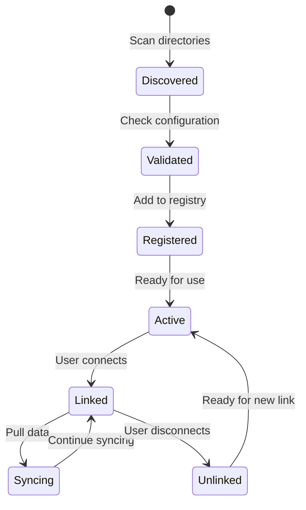

## Provider System Overview

The provider system is the core of Mirobody Health, enabling seamless integration with various health device APIs through a standardized interface.

<Info>
The provider system follows a plugin architecture, making it easy to add new integrations without modifying core code.
</Info>

## Key Concepts

<CardGroup cols={2}>
  <Card title="Provider" icon="plug">
    A plugin that integrates with a specific health device API (e.g., Garmin, Whoop)
  </Card>
  <Card title="BaseThetaProvider" icon="cube">
    Abstract base class that all providers must inherit from
  </Card>
  <Card title="Provider Discovery" icon="magnifying-glass">
    Automatic detection and loading of provider plugins from configured directories
  </Card>
  <Card title="Provider Registry" icon="list">
    Central registry of all available and active providers
  </Card>
</CardGroup>

## Provider Lifecycle

For more details, see the [Provider Overview](/providers/overview).
