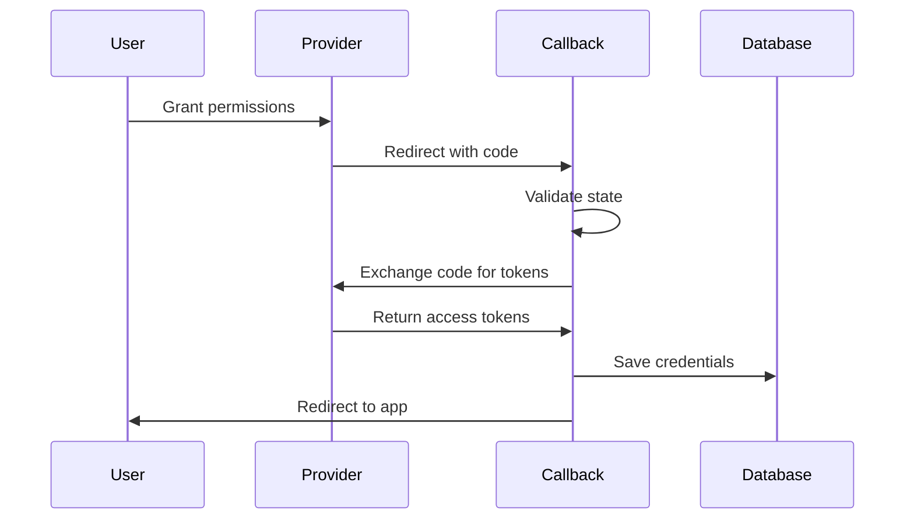

## Endpoint

```
GET /api/v1/pulse/theta/{provider_slug}/callback
```

## Overview

This endpoint is called by the health provider after the user grants permissions. It completes the OAuth flow by exchanging the authorization code for access tokens and saves the credentials.

<Warning>
This endpoint is called automatically by the provider's OAuth redirect. You don't need to call this endpoint directly in your application.
</Warning>

## How It Works

When a user completes authorization on the provider's website, the provider redirects back to this callback URL with authorization codes. Mirobody Health then:

1. Validates the OAuth state parameter
2. Exchanges the authorization code for access tokens
3. Saves encrypted credentials to the database
4. Triggers an initial data sync
5. Redirects the user (if `return_url` was provided)

## OAuth 2.0 Callback Parameters

<ParamField query="code" type="string" required>
  Authorization code from the provider
</ParamField>

<ParamField query="state" type="string" required>
  State parameter for CSRF protection
</ParamField>

## OAuth 1.0 Callback Parameters

<ParamField query="oauth_token" type="string" required>
  OAuth request token
</ParamField>

<ParamField query="oauth_verifier" type="string" required>
  OAuth verifier code
</ParamField>

## Callback Flow



## Response

After processing, the callback typically redirects the user. If called directly or in error cases, it returns JSON:

<ResponseExample>
```json Success
{
  "provider_slug": "theta_garmin",
  "access_token": "abc123...",
  "stage": "completed"
}
```
</ResponseExample>

<ResponseExample>
```json Error
{
  "error": {
    "code": "INVALID_STATE",
    "message": "OAuth state parameter is invalid or expired"
  }
}
```
</ResponseExample>

## Troubleshooting

<AccordionGroup>
  <Accordion title="Invalid State Error" icon="triangle-exclamation">
    **Cause**: State parameter doesn't match or has expired

    **Solutions**:
    - Ensure user completes authorization within 15 minutes
    - Don't modify the authorization URL
    - Check that Redis is running and accessible
  </Accordion>

  <Accordion title="Token Exchange Failed" icon="key">
    **Cause**: Provider rejected the code exchange

    **Solutions**:
    - Verify OAuth credentials are correct
    - Check redirect URI matches provider configuration
    - Ensure authorization code hasn't expired (usually 10 minutes)
  </Accordion>

  <Accordion title="Redirect Loop" icon="rotate">
    **Cause**: Callback URL misconfigured

    **Solutions**:
    - Verify callback URL in provider developer portal
    - Check for typos in redirect URL configuration
    - Ensure URL protocol matches (http vs https)
  </Accordion>
</AccordionGroup>

<Note>
This endpoint is configured as the OAuth callback URL in each provider's developer portal. The exact URL format is:

```
http://localhost:18080/api/v1/pulse/theta/{provider_slug}/callback
```

Replace with your production domain in production environments.
</Note>
