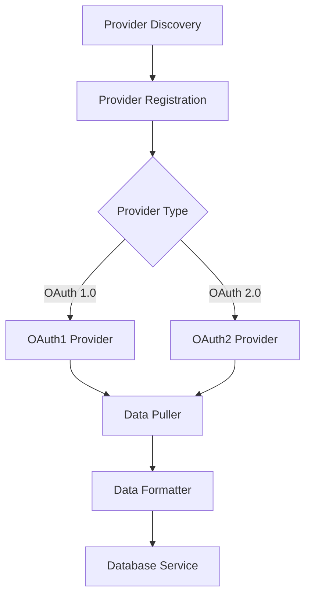
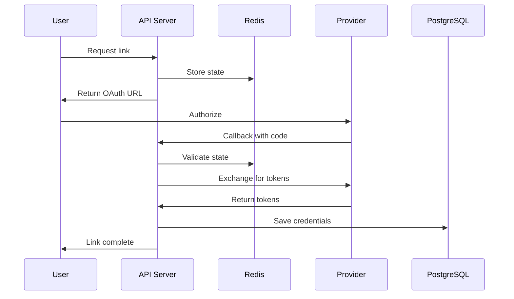
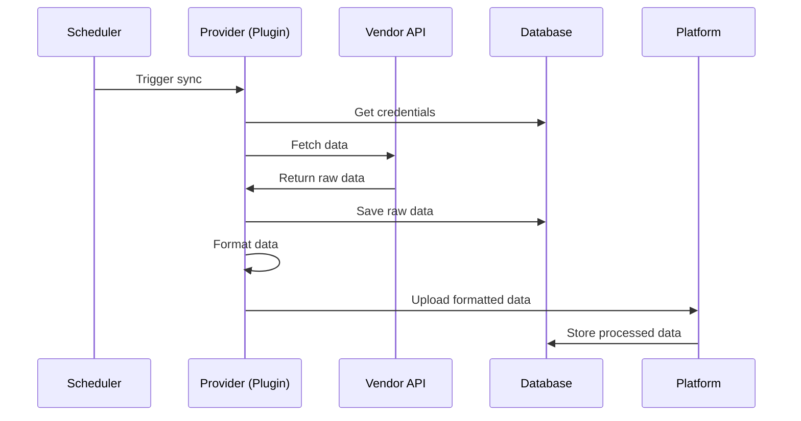

## System Architecture

Mirobody Health is built with a modular, layered architecture that separates concerns and enables easy extensibility.

## Core Components

<CardGroup cols={2}>
  <Card title="API Layer" icon="server">
    FastAPI-based REST API for external integrations
  </Card>
  <Card title="Provider System" icon="plug">
    Pluggable OAuth integrations for health devices
  </Card>
  <Card title="Data Pipeline" icon="arrow-progress">
    ETL pipeline for health data transformation
  </Card>
  <Card title="AI Services" icon="brain">
    Multi-provider LLM integration for chat
  </Card>
  <Card title="MCP Protocol" icon="bolt">
    Model Context Protocol for AI agents
  </Card>
  <Card title="Storage Layer" icon="database">
    PostgreSQL and Redis for data persistence
  </Card>
</CardGroup>

## Architecture Layers

### 1. API Layer

The API layer provides RESTful endpoints for all system interactions:

```
HTTP Server (FastAPI)
├── /api/v1/pulse/          # Health provider endpoints
├── /api/chat               # AI chat interface
├── /api/history            # Session history
└── /mcp                    # MCP protocol endpoint
```

**Key Features:**
- Async request handling with FastAPI
- Automatic API documentation (OpenAPI/Swagger)
- CORS support for web clients
- Request validation with Pydantic models
- JWT-based authentication

### 2. Provider System

Pluggable architecture for health device integrations:



**Components:**
- `BaseThetaProvider`: Abstract base class for all providers
- `ThetaDataFormatter`: Standard data transformation utilities
- `ThetaTimeUtils`: Timezone and timestamp handling
- Provider-specific implementations (Garmin, Whoop, etc.)

### 3. Data Pipeline (TBD)

ETL (Extract, Transform, Load) pipeline for health data:

```
┌─────────────┐
│  Pull Data  │ ─┐
└─────────────┘  │
                 │
┌─────────────┐  │  ┌──────────────┐
│  Save Raw   │ ◄┴─▶│ Push Service │
└─────────────┘     └──────────────┘
        │                   │
        ▼                   ▼
┌─────────────┐    ┌──────────────┐
│  Format     │    │  Upload      │
└─────────────┘    └──────────────┘
        │                   │
        ▼                   ▼
┌─────────────┐    ┌──────────────┐
│ Standardize │    │  Platform    │
└─────────────┘    └──────────────┘
```

**Flow:**
1. **Pull**: Fetch data from vendor API
2. **Save**: Store raw data in database
3. **Format**: Transform to standard format
4. **Upload**: Push to Mirobody platform

### 4. AI Services

Multi-provider LLM integration for intelligent health insights:

```python
AI Services
├── OpenRouter (Multi-model)
├── OpenAI 
├── Google
├── Anthropic
└── Local LLMs (coming later)
```

**Features:**
- Provider-agnostic interface
- Context management for conversations
- Tool calling for health data access
- Session history persistence

### 5. MCP Protocol

Model Context Protocol support for AI agent integration:

```
MCP Server
├── Tools/        # Available tools
│   ├── get_user_health_profile
│   ├── get_health_indicator
│   ├── genetic_service
│   └── your custom tools
├── Resources/    # Available resources
```

**Capabilities:**
- JSON-RPC 2.0 interface
- Tool discovery and execution
- Resource management
- Agent orchestration

### 6. Storage Layer

Dual storage system for different data types:

<Tabs>
  <Tab title="PostgreSQL">
    **Used for:**
    - User credentials (encrypted)
    - OAuth tokens and refresh tokens
    - Raw health data (JSONB)
    - Provider configurations
    - Session history

  </Tab>

  <Tab title="Redis">
    **Used for:**
    - OAuth state parameters (short-lived)
    - Session tokens
    - Rate limiting counters
    - Caching API responses
    - Temporary data storage

    **Key Patterns:**
    ```
    oauth2:state:{state}      # OAuth state
    oauth:secret:{token}      # OAuth 1.0 secrets
    cache:user:{user_id}      # User data cache
    rate:{provider}:{user}    # Rate limiting
    ```
  </Tab>
</Tabs>

## Data Flow

### OAuth Authentication Flow



### Health Data Synchronization



## Design Patterns

### Plugin Architecture

Providers are discovered and loaded dynamically:

```python
# Provider discovery
THETA_PROVIDER_DIRS = ["connect/theta"]

# Automatic loading
for directory in THETA_PROVIDER_DIRS:
    providers = discover_providers(directory)
    for provider_class in providers:
        provider = provider_class.create_provider(config)
        if provider:
            register_provider(provider)
```

### Factory Pattern

Providers use factory methods for conditional instantiation:

```python
@classmethod
def create_provider(cls, config: Dict) -> Optional['Provider']:
    """Factory method - returns None if config invalid"""
    if not cls._validate_config(config):
        return None
    return cls()
```

### Strategy Pattern

Different OAuth strategies for OAuth 1.0 vs 2.0:

```python
class BaseThetaProvider:
    def link(self, request) -> Dict:
        """Implemented by OAuth1 or OAuth2 strategy"""
        pass
    
    def callback(self, *args, **kwargs) -> Dict:
        """Implemented by OAuth1 or OAuth2 strategy"""
        pass
```

### Repository Pattern

Database operations abstracted through services:

```python
class DatabaseService:
    async def save_oauth2_credentials(self, ...): pass
    async def get_user_credentials(self, ...): pass
    async def delete_user_theta_provider(self, ...): pass
```

## Security Architecture

<AccordionGroup>
  <Accordion title="Authentication & Authorization" icon="key">
    - JWT-based API authentication
    - OAuth 1.0/2.0 for provider access
    - Encrypted credential storage
    - Per-user provider access control
  </Accordion>

  <Accordion title="Data Protection" icon="shield">
    - Database-level encryption
    - Encrypted OAuth tokens
    - HTTPS for all external communication
    - Sensitive data never logged
  </Accordion>

  <Accordion title="Access Control" icon="lock">
    - User-scoped data access
    - Provider-specific permissions
    - API rate limiting
    - CORS policies
  </Accordion>

  <Accordion title="Secure Communication" icon="shield-halved">
    - TLS/SSL for external APIs
    - State parameter for OAuth CSRF protection
    - Token refresh mechanisms
    - Secure session management
  </Accordion>
</AccordionGroup>

## Scalability Considerations

### Horizontal Scaling

The system supports horizontal scaling:

<CardGroup cols={2}>
  <Card title="Stateless API" icon="server">
    API servers are stateless, enabling horizontal scaling behind a load balancer
  </Card>
  <Card title="Distributed Cache" icon="layer-group">
    Redis supports clustering for distributed caching
  </Card>
  <Card title="Database Pooling" icon="database">
    Connection pooling enables multiple API instances
  </Card>
  <Card title="Async Processing" icon="arrows-spin">
    Async/await enables high concurrency per instance
  </Card>
</CardGroup>


## Deployment Architecture

### Docker Compose Architecture

```yaml
services:
  backend:
    image: mirobody-backend
    ports: ["18080:18080"]
    depends_on: [db, redis]
    
  db:
    image: postgres:15
    volumes: ["pgdata:/var/lib/postgresql/data"]
    
  redis:
    image: redis:7
    volumes: ["redis-data:/data"]

volumes:
  pgdata:
  redis-data:
```

## Monitoring & Observability

### Logging

Structured logging throughout the system:

```python
# Log levels
LOG_LEVEL: INFO  # DEBUG, INFO, WARNING, ERROR, CRITICAL

# Contextual logging
logging.info(
    "Data pull completed",
    extra={
        "user_id": user_id,
        "provider": provider_slug,
        "records": len(data),
        "duration_ms": duration
    }
)
```

### Metrics

Track key performance indicators:

- Request latency
- Provider success rates
- Data processing throughput
- Error rates by provider
- Token refresh rates

### Health Checks

```python
GET /health
{
  "status": "healthy",
  "version": "1.0.1",
  "services": {
    "database": "connected",
    "redis": "connected"
  }
}
```

## Technology Stack

<Tabs>
  <Tab title="Backend">
    - **Python 3.12+**: Core language
    - **FastAPI**: Web framework
    - **asyncio**: Async I/O
    - **Pydantic**: Data validation
    - **SQLAlchemy**: Database ORM
  </Tab>

  <Tab title="Storage">
    - **PostgreSQL 15**: Relational database
    - **Redis 7**: Cache and session store
    - **JSONB**: Flexible data storage
    - **S3 (optional)**: Object storage
  </Tab>

  <Tab title="Integration">
    - **aiohttp**: Async HTTP client
    - **requests-oauthlib**: OAuth 1.0
    - **OAuth 2.0**: Modern auth
    - **JSON-RPC 2.0**: MCP protocol
  </Tab>

  <Tab title="DevOps">
    - **Docker**: Containerization
    - **Docker Compose**: Local deployment
    - **pytest**: Testing framework
    - **GitHub Actions**: CI/CD
  </Tab>
</Tabs>

## Extensibility Points

The architecture provides multiple extension points:

<AccordionGroup>
  <Accordion title="New Providers" icon="plus">
    See [Development](/en/development/setup) new health device integrations:
  </Accordion>

  <Accordion title="Tools & MCPs" icon="wrench">
    1. See [Adding Custom Tools](/en/tools/adding-tools) to add new tools for AI agents
    2. See [Adding Custom MCPs](/en/tools/adding-mcps) to add new MCPs for AI agents
  </Accordion>

  <Accordion title="Custom Indicators" icon="chart-line">
    Add new health metrics:
    1. Define in `StandardIndicator` enum
    2. Specify standard unit
    3. Update provider mappings
  </Accordion>

  <Accordion title="AI Providers" icon="robot">
    Add new LLM providers:
    1. Implement provider interface
    2. Add configuration
    3. Register in agent system
    4. Deploy
  </Accordion>
</AccordionGroup>

## Best Practices

<CardGroup cols={2}>
  <Card title="Separation of Concerns" icon="layer-group">
    Each layer has a single responsibility
  </Card>
  <Card title="Dependency Injection" icon="syringe">
    Services injected, not hard-coded
  </Card>
  <Card title="Interface-Based Design" icon="cube">
    Program to interfaces, not implementations
  </Card>
  <Card title="Configuration-Driven" icon="gears">
    Behavior controlled via configuration
  </Card>
  <Card title="Async First" icon="bolt">
    Async/await for all I/O operations
  </Card>
  <Card title="Error Handling" icon="triangle-exclamation">
    Graceful degradation and recovery
  </Card>
</CardGroup>

## Next Steps

<CardGroup cols={2}>
  <Card title="Provider System" icon="plug" href="/en/concepts/providers">
    Deep dive into the provider system
  </Card>
  <Card title="Data Flow" icon="arrow-progress" href="/en/concepts/data-flow">
    Understanding data transformation
  </Card>
  <Card title="Development Setup" icon="code" href="/en/development/setup">
    Set up your development environment
  </Card>
  <Card title="Deployment" icon="rocket" href="/en/deployment/docker">
    Deploy Mirobody Health
  </Card>
</CardGroup>
