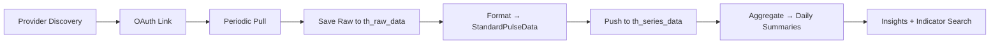

Mirobody is a layered, plugin-friendly engine. Each layer can be replaced or extended independently — no monoliths, no hidden coupling.

```
┌──────────────────────────────────────────────────────────────────┐
│  Clients                                                          │
│  ─────────────────────────────────────────────────────────────    │
│  Web app (local + mirobody.ai)  •  ChatGPT Apps  •  Claude        │
│  Cursor  •  any MCP client                                         │
└─────────────────────────┬────────────────────────────────────────┘
                          │  HTTP / MCP (JSON-RPC 2.0) / OAuth
┌─────────────────────────▼────────────────────────────────────────┐
│  AI & Agent Engine                                                │
│  ─────────────────────────────────────────────────────────────    │
│  Chat service · DeepAgent / MixAgent / BaselineAgent · MCP        │
│  server · LLM clients · Tools · Skills · Embeddings · Prompts     │
└─────────────────────────┬────────────────────────────────────────┘
                          │
┌─────────────────────────▼────────────────────────────────────────┐
│  FHIR & Health Standards                                          │
│  ─────────────────────────────────────────────────────────────    │
│  400+ StandardIndicator · FHIR / LOINC / SNOMED CT / RxNorm /     │
│  CVX / DCM cross-vocab · unit normalization · concept graph       │
└─────────────────────────┬────────────────────────────────────────┘
                          │
┌─────────────────────────▼────────────────────────────────────────┐
│  Health Data Pipeline (Pulse)                                     │
│  ─────────────────────────────────────────────────────────────    │
│  300+ wearables · Apple/Google Health · EHR · file parser         │
│  (PDF/Excel/CSV/audio/image/genetic) · aggregation · insights     │
└─────────────────────────┬────────────────────────────────────────┘
                          │
┌─────────────────────────▼────────────────────────────────────────┐
│  Infrastructure                                                   │
│  ─────────────────────────────────────────────────────────────    │
│  Starlette ASGI · JWT / OAuth / WebAuthn · async PostgreSQL +     │
│  pgvector · Redis · Local / S3 / Aliyun OSS storage · E2B sandbox │
└──────────────────────────────────────────────────────────────────┘
```

## AI & Agent Engine

| Module | Path | Description |
|--------|------|-------------|
| **Chat Service** | `mirobody/chat/` | Session management, conversation history, HTTP + WebSocket streaming adapters, memory integration, session sharing |
| **Agent Implementations** | `mirobody/pub/agents/` | DeepAgent (LangChain-based), MixAgent (two-phase fusion), BaselineAgent (direct LLM) |
| **LLM Clients** | `mirobody/utils/llm/` | Provider-agnostic adapter for OpenAI, Gemini, Anthropic, Azure OpenAI, Volcengine, Dashscope. HIPAA-compliant routing for clinical workloads |
| **MCP Server** | `mirobody/mcp/` | JSON-RPC 2.0, local + HTTP remote endpoint, auto-discovers tools and resources |
| **Tools** | `mirobody/pub/tools/`, `tools/` | Built-in tools (file ops, charts, `execute`) + your drop-in Python files |
| **Skills** | `skills/` | Claude Agent Skills (`SKILL.md` + `metadata.json`) auto-discovered at startup |
| **Embeddings** | `mirobody/utils/embedding.py` | 1024-dim provider-agnostic embeddings (Gemini / Qwen), pgvector semantic search |
| **Prompt Templates** | `prompts/` | Jinja2 system prompts with dynamic context (user timezone, available tools, health profile) |

### Three agents, three jobs

| Agent | Phases | Use case |
|---|---|---|
| **DeepAgent** | Single model handles tools + response | Complex multi-step research, file ops, planning |
| **MixAgent** | Orchestrator model (e.g. Claude Sonnet) → Responder model (e.g. Gemini Flash) | High-volume workloads where reasoning matters more than narration |
| **BaselineAgent** | Direct LLM chat, no tools | Simple Q&A, low-latency, testing |

DeepAgent is the default. See [Tools Overview](/en/tools/overview) for switching and configuration.

### Tools and Skills

**Tools** are plain Python functions in `tools/` — type hints + docstrings are the only "schema". Mirobody parses them once at startup and exposes them via MCP.

```python
# tools/my_tool.py
def get_my_metric(date: str, user_info: dict) -> dict:
    """
    Fetch a custom metric for the given date.

    Args:
        date: ISO 8601 date string.

    Returns:
        Dict containing the metric value and unit.
    """
    user_id = user_info["user_id"]    # injected by Mirobody from JWT
    return {"value": 42, "unit": "steps"}
```

**Skills** are Claude Agent Skills — a `SKILL.md` (the playbook the agent reads when the skill activates) plus a `metadata.json` (Mirobody-specific, used for discovery and IDE integration).

```
skills/glucose-coach/
├── metadata.json   # name, summary, when_to_use, when_not_to_use, tags
└── SKILL.md        # YAML frontmatter (name, description, license) + body
```

See [Adding Tools](/en/tools/adding-tools) and [MCP Integration](/en/tools/mcp-integration) for details.

## FHIR & Health Standards

| Module | Path | Description |
|--------|------|-------------|
| **FHIR Mapping** | `mirobody/pulse/core/fhir_mapping.py` | In-memory cache `indicator → FHIR code`, with optional auto-registration of new codes |
| **Indicator Registry** | `mirobody/pulse/core/indicators_info.py` | 400+ `StandardIndicator` enum, multi-source (Vital, Apple Health, Garmin, Whoop, Renpho, ...) |
| **Unit Conversion** | `mirobody/pulse/core/units.py` | Bidirectional: kg ↔ lb, °C ↔ °F, mg·dL⁻¹ ↔ mmol·L⁻¹, mmHg ↔ kPa, etc. |
| **Indicator Search** | `mirobody/indicator/` | Embedding-based free-text → indicator code + concept-graph expansion across LOINC / SNOMED CT / RxNorm / CVX / DCM |
| **Concept Graph** | `mirobody/indicator/concept_graph.py` + `fhir_concept_graph.bin` | Cross-vocabulary bridges and same-system siblings; pulled via Git LFS |

### Two retrieval modes

| Method | Scope | Input | Returns |
|--------|-------|-------|---------|
| `adapter.search(user_id, embeddings, top_k)` | Per-user | Pre-computed query embeddings | What does *this user* have that matches? |
| `adapter.resolve(term, top_k)` | Global | Free text | What canonical codes does this term map to? |
| `adapter.resolve_many(terms, top_k)` | Global, batched | List of free text | ~20–30× faster than looping `resolve()` |

`search` joins `th_series_data` to scope to one user; `resolve` runs cosine over the full vocabulary and returns the global top-k *per code system* (LOINC, SNOMED CT, RXNORM, CVX, DCM, THETA).

### Unit normalization

Free-text "value + unit" strings from any device or chart, in any of the supported languages (en, zh, ja, ko, ru, de, fr, es), get normalized to a canonical UCUM unit plus a LOINC PROPERTY family:

```
"90次每分钟"    → ParsedQuantity(value=90.0,  unit="/min",   family="NRat")
"<5.6 mg/dL"   → ParsedQuantity(value=5.6,   unit="mg/dL",  family="MCnc", comparator="<")
"Millimol pro Liter" → "mmol/L"
"600步"        → ParsedQuantity(value=600.0, unit="{steps}", family="Num")
```

Pure local computation — no DB, no embedding API.

## Health Data Pipeline (Pulse)

| Module | Path | Description |
|--------|------|-------------|
| **Platform Manager** | `mirobody/pulse/` | Platform–Provider plugin architecture, normalization to `StandardPulseData` |
| **Theta Platform** | `mirobody/pulse/theta/` | Direct device integrations: Garmin, Whoop, Oura, Renpho, PostgreSQL, more |
| **Apple Health** | `mirobody/pulse/apple/` | Apple Health import, CDA (Clinical Document Architecture) processing |
| **Data Upload** | `mirobody/pulse/data_upload/` | `StandardPulseData` → `th_series_data` write pipeline |
| **File Parser** | `mirobody/pulse/file_parser/` | Multi-format: PDF, CSV, Excel, audio, image, genetic; LLM-powered indicator extraction |
| **Aggregation** | `mirobody/pulse/core/aggregate_indicator/` | Series → daily summaries; derived metrics; sleep window 18:00–18:00 |
| **Health Insights** | `mirobody/pulse/core/insight/` | AI-powered trend detection, anomaly analysis, pattern recipes (multi-signal, recovery, glucose) |

### Provider lifecycle


```mermaid
graph LR
    A[Provider Discovery] --> B[OAuth Link]
    B --> C[Periodic Pull]
    C --> D[Save Raw to th_raw_data]
    D --> E[Format → StandardPulseData]
    E --> F[Push to th_series_data]
    F --> G[Aggregate → Daily Summaries]
    G --> H[Insights + Indicator Search]
```

Every provider, whether built-in (`mirobody/pulse/theta/mirobody_garmin/`) or custom (`providers/mirobody_mydevice/`), implements the same `BaseThetaProvider` contract — see [Provider Integration](/en/development/provider-integration).

## Infrastructure

| Module | Path | Description |
|--------|------|-------------|
| **Configuration** | `mirobody/utils/config/` | YAML + env var layered config, Fernet encryption for `_KEY`/`_SECRET`/`_TOKEN`/etc. |
| **Storage Backend** | `mirobody/utils/config/storage/` | Pluggable: Local filesystem, AWS S3, Aliyun OSS |
| **Auth & User** | `mirobody/user/` | JWT, OAuth 2.0 (Google / Apple), WebAuthn / FIDO2, email verification |
| **Server** | `mirobody/server/` | Starlette ASGI, JWT middleware, rate limiting |
| **Database** | `mirobody/utils/db.py` | Async PostgreSQL (psycopg) + pgvector, Redis cache/session store |
| **Sandbox** | E2B (external) | `execute` tool runs shell + Python in isolated cloud sandboxes |

### Configuration layering

```
config.yaml            ← base, do not edit
  └── config.{env}.yaml  ← your overrides; ENV=localdb → config.localdb.yaml
       └── env vars       ← highest precedence; injected by .env or shell
```

Sensitive keys (anything whose name contains `_KEY`, `_PASSWORD`, `_PASS`, `_PWD`, `_SECRET`, `_SK`, `_TOKEN`) are auto-encrypted on first load using your `CONFIG_ENCRYPTION_KEY`. See [Configuration](/en/configuration).

## Extension Points

Drop a file in and Mirobody picks it up at next startup:

| Directory | Discovered as | Naming convention |
|-----------|---------------|-------------------|
| `tools/` | MCP tools | Files ending in `.py`; functions or `*Service` classes; `_*.py` files are ignored |
| `skills/` | Claude Agent Skills | One sub-directory per skill, each with `SKILL.md` + `metadata.json` |
| `agents/` | Conversational agents | `*Agent` classes; require an async `generate_response` |
| `providers/` | Data providers | `mirobody_<slug>/provider_<slug>.py` extending `BaseThetaProvider` |
| `prompts/` | Prompt templates | Jinja2 `.jinja` files referenced via `PROMPTS_<AGENT>` |
| `resources/` | MCP resources | HTML, JSON, or other static files exposed over MCP |

Custom directories take precedence over built-ins of the same name.

## End-to-end request flow

Here's what happens when a user sends "Show me my knee pain trend" in the web UI:

```
1. Browser POSTs to /api/chat (SSE).
2. JWT middleware → user_id.
3. Chat service creates/uses a session, persists user message to th_messages.
4. DeepAgent (default) is loaded with the user's PROVIDERS_DEEP config.
5. Agent calls tools/list via MCP, plans, then calls tools:
   - get_user_profile  → user_id, timezone, available providers
   - indicator search  → "knee pain" → SNOMED CT / LOINC candidates
   - get_health_data   → time series joined by user_id + indicator
   - chart_service     → renders PNG, uploads to S3, returns presigned URL
6. Agent streams thinking / reply chunks via SSE; response is persisted.
7. Aggregator + insights run in background for next session.
```

For the session-sharing read-path (no auth), see [Session Sharing](/en/api-reference/chat/share).

## Where to go next

<CardGroup cols={2}>
  <Card title="Providers" icon="plug" href="/en/concepts/providers">
    How devices and EHRs hook in
  </Card>
  <Card title="Data Flow" icon="arrow-progress" href="/en/concepts/data-flow">
    From raw vendor payloads to normalized indicators
  </Card>
  <Card title="File Processing" icon="file" href="/en/concepts/file-processing">
    Multi-format file ingestion and parsing
  </Card>
  <Card title="Tools & MCP" icon="bolt" href="/en/tools/overview">
    Build and expose tools across the MCP ecosystem
  </Card>
</CardGroup>
