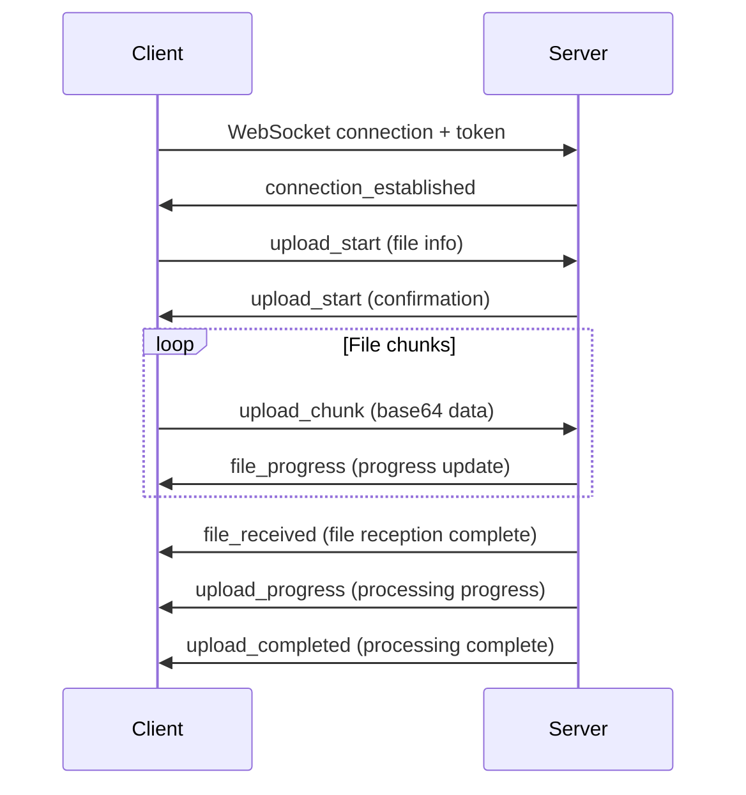

## Overview

This module provides comprehensive health data file processing capabilities, including file upload, health indicator extraction, and file deletion. The system uses a modular design, supports multiple file types, and provides real-time progress feedback.

## Features

- ✅ **Multiple Upload Methods**: WebSocket real-time upload and REST API batch upload
- ✅ **Real-time Progress Feedback**: WebSocket connections provide real-time progress updates
- ✅ **Smart File Recognition**: Automatically identifies file types and selects appropriate handler
- ✅ **Health Indicator Extraction**: Uses LLM to automatically extract health indicator data
- ✅ **Multi-format Support**: PDF, images, audio, genetic data, and more
- ✅ **PDF Parallel Processing**: Multi-page PDFs processed in parallel for efficiency
- ✅ **File Summary Generation**: Automatically generates file content summaries
- ✅ **Cascade Deletion**: Automatically cleans up associated health data when files are deleted

## Supported File Types

| File Type | MIME Type | Handler | Description |
|-----------|-----------|---------|-------------|
| PDF | `application/pdf` | `PDFHandler` | Multi-page parallel processing with automatic health indicator extraction |
| Images | `image/*` | `ImageHandler` | Supports JPEG, PNG, GIF, WebP; recognizes health reports and extracts indicators |
| Audio | `audio/*` | `AudioHandler` | Speech-to-text conversion for extracting verbal health information |
| Genetic Data | Specific formats | `GeneticHandler` | Genetic test report parsing |

## File Upload Methods

### WebSocket Upload (Recommended)

WebSocket upload provides real-time progress feedback, ideal for large file uploads and scenarios requiring real-time status updates.

#### Endpoint

```
ws://<host>/ws/upload-health-report?token=<auth_token>
```

#### Connection Flow



#### Message Types

##### 1. Upload Start (upload_start)

Client sends:
```json
{
    "type": "upload_start",
    "messageId": "unique-message-id",
    "sessionId": "session-id",
    "query": "user notes",
    "isFirstMessage": false,
    "query_user_id": "target-user-id",
    "files": [
        {
            "filename": "report.pdf",
            "contentType": "application/pdf",
            "size": 1024000
        }
    ]
}
```

| Field | Type | Required | Description |
|-------|------|----------|-------------|
| type | string | ✅ | Must be "upload_start" |
| messageId | string | ❌ | Unique message ID, auto-generated if not provided |
| sessionId | string | ✅ | Session ID |
| query | string | ❌ | User notes or query text |
| isFirstMessage | boolean | ❌ | Whether this is the first message of a new session |
| query_user_id | string | ❌ | Target user ID for proxy uploads |
| files | array | ✅ | Array of file metadata |

Server response:
```json
{
    "type": "upload_start",
    "messageId": "generated-message-id",
    "sessionId": "session-id",
    "status": "uploading",
    "progress": 0,
    "message": "Ready to receive 1 files",
    "files": [...]
}
```

##### 2. Upload Chunk (upload_chunk)

Client sends:
```json
{
    "type": "upload_chunk",
    "messageId": "message-id",
    "filename": "report.pdf",
    "chunk": "<base64-encoded-data>",
    "chunkIndex": 0,
    "totalChunks": 10,
    "contentType": "application/pdf",
    "fileSize": 1024000
}
```

Server response:
```json
{
    "type": "file_progress",
    "messageId": "message-id",
    "filename": "report.pdf",
    "progress": 10.0,
    "status": "uploading",
    "message": "Uploading report.pdf: 10.0%"
}
```

##### 3. File Received (file_received)

```json
{
    "type": "file_received",
    "messageId": "message-id",
    "filename": "report.pdf",
    "status": "received",
    "message": "File report.pdf received successfully",
    "size": 1024000
}
```

##### 4. Upload Progress (upload_progress)

```json
{
    "type": "upload_progress",
    "messageId": "message-id",
    "status": "processing",
    "progress": 65,
    "message": "Starting to analyze health indicators in report.pdf...",
    "filename": "report.pdf",
    "timestamp": "2024-01-15T10:30:00.000Z"
}
```

##### 5. Upload Completed (upload_completed)

```json
{
    "type": "upload_completed",
    "messageId": "message-id",
    "status": "completed",
    "progress": 100,
    "message": "Processing completed: 1 files successful",
    "successful_files": 1,
    "failed_files": 0,
    "total_files": 1,
    "results": {
        "success": true,
        "message": "File processing completed",
        "type": "pdf",
        "url_thumb": ["https://..."],
        "url_full": ["https://..."],
        "files": [
            {
                "filename": "report.pdf",
                "type": "pdf",
                "url_thumb": "https://...",
                "url_full": "https://...",
                "file_key": "uploads/xxx.pdf",
                "file_size": 1024000,
                "file_abstract": "Health report summary...",
                "file_name": "2024 Annual Health Report",
                "success": true
            }
        ]
    }
}
```

##### 6. Heartbeat (ping/pong)

Client sends:
```json
{
    "type": "ping"
}
```

Server response:
```json
{
    "type": "pong",
    "timestamp": "2024-01-15T10:30:00.000Z"
}
```

#### Timeout Mechanism

| Type | Duration | Description |
|------|----------|-------------|
| Idle Timeout | 5 minutes | Auto-disconnect when no activity |
| Upload Timeout | 30 minutes | Extended timeout during active uploads |
| Heartbeat | 30 seconds | Recommended ping interval |

### REST API Upload

REST API provides a simple file upload method, suitable for simple scenarios or applications that don't require real-time progress.

#### Endpoint

```http
POST /files/upload
Content-Type: multipart/form-data
Authorization: Bearer <token>
```

#### Request Parameters

| Parameter | Type | Required | Description |
|-----------|------|----------|-------------|
| files | File[] | ✅ | List of files to upload |
| folder | string | ❌ | Custom folder prefix, defaults to 'uploads' |

#### Response Example

```json
{
    "code": 0,
    "msg": "All 2 files uploaded successfully",
    "data": [
        {
            "file_url": "https://storage.example.com/uploads/20240115_xxx.pdf",
            "file_name": "report.pdf",
            "file_key": "uploads/20240115_xxx.pdf",
            "file_size": 1024000,
            "file_type": "application/pdf",
            "upload_time": "2024-01-15T10:30:00.000Z",
            "duration": null
        }
    ]
}
```

#### Response Codes

| Code | Description |
|------|-------------|
| 0 | All uploads successful |
| 1 | Partial or complete failure |

## Processing Architecture

### Overview

```
┌───────────────────────────────────────────────────────────────┐
│                         File Upload                           │
│  ┌─────────────┐    ┌─────────────┐    ┌─────────────┐        │
│  │  WebSocket  │    │  REST API   │    │   Direct    │        │
│  │   Upload    │    │   Upload    │    │   Upload    │        │
│  └──────┬──────┘    └──────┬──────┘    └──────┬──────┘        │
│         │                  │                  │                │
│         └──────────────────┼──────────────────┘                │
│                            ▼                                   │
│                   ┌─────────────────┐                          │
│                   │  FileProcessor  │                          │
│                   └────────┬────────┘                          │
│                            │                                   │
│         ┌──────────────────┼──────────────────┐                │
│         ▼                  ▼                  ▼                │
│  ┌─────────────┐   ┌─────────────┐   ┌─────────────┐          │
│  │ PDFHandler  │   │ImageHandler │   │AudioHandler │   ...    │
│  └──────┬──────┘   └──────┬──────┘   └──────┬──────┘          │
│         │                  │                  │                │
│         └──────────────────┼──────────────────┘                │
│                            ▼                                   │
│                  ┌───────────────────┐                         │
│                  │IndicatorExtractor │                         │
│                  └─────────┬─────────┘                         │
│                            ▼                                   │
│                   ┌─────────────────┐                          │
│                   │    Database     │                          │
│                   │  (th_messages,  │                          │
│                   │  th_series_data)│                          │
│                   └─────────────────┘                          │
└───────────────────────────────────────────────────────────────┘
```

### Processing Steps

#### 1. File Upload Phase (0-30%)

- Receive file data
- Validate file type and size
- Generate unique file identifier
- Upload to object storage (S3/OSS/MinIO)

#### 2. File Type Recognition (30-35%)

The system automatically identifies file types via `FileHandlerFactory`:

```python
# Handler selection priority
1. GeneticHandler  - Genetic data files
2. ImageHandler    - Image files (image/*)
3. PDFHandler      - PDF documents
4. AudioHandler    - Audio files (audio/*)
```

#### 3. Content Processing Phase (35-90%)

**PDF File Processing:**
```
Single/few page PDF:
  35-65%: File upload and save
  65-90%: LLM indicator extraction

Multi-page PDF (>2 pages):
  35-50%: File upload and PDF splitting
  50-70%: Parallel page processing
  70-90%: Result merging and deduplication
```

**Image File Processing:**
```
35-55%: Image upload
55-90%: Recognition + indicator extraction
```

#### 4. Summary Generation Phase (90-95%)

- Generate file content summary using LLM
- Generate intelligent file name

#### 5. Result Saving Phase (95-100%)

- Save processing results to database
- Sync health indicators to `th_series_data`
- Update user health profile

## Health Indicator Extraction

### Configuration

```yaml config.yaml
ENABLE_INDICATOR_EXTRACTION: 1  # Set to 1 to enable indicator extraction
```

### Supported Indicator Types

- Complete Blood Count (WBC, RBC, Hemoglobin, etc.)
- Biochemistry (Liver function, Kidney function, Lipids, etc.)
- Physical Examination (Blood pressure, Heart rate, Weight, etc.)
- Tumor Markers
- Thyroid Function
- Other Medical Test Indicators

### Extraction Result Format

```json
{
    "indicators": [
        {
            "original_indicator": "White Blood Cell Count",
            "value": "6.5",
            "unit": "10^9/L",
            "reference_range": "4.0-10.0",
            "status": "normal"
        },
        {
            "original_indicator": "Hemoglobin",
            "value": "145",
            "unit": "g/L",
            "reference_range": "120-160",
            "status": "normal"
        }
    ],
    "content_info": {
        "date_time": "2024-01-15",
        "institution": "XX Hospital"
    },
    "file_abstract": "January 2024 health report including CBC, comprehensive metabolic panel..."
}
```

### Data Storage

Extracted indicator data is stored in the `th_series_data` table:

| Field | Description |
|-------|-------------|
| user_id | User ID |
| indicator_id | Indicator ID (linked to indicator dimension table) |
| value | Indicator value |
| unit | Unit of measurement |
| source_table | Source table name |
| source_table_id | Source record ID (message_id + file_key) |
| recorded_at | Test date/time |

## File Deletion

### Endpoint

```http
POST /api/v1/data/delete-files
Content-Type: application/json
Authorization: Bearer <token>
```

### Request Body

```json
{
    "message_id": "message-uuid",
    "file_keys": ["uploads/xxx.pdf", "uploads/yyy.jpg"]
}
```

| Parameter | Type | Required | Description |
|-----------|------|----------|-------------|
| message_id | string | ✅ | Message ID |
| file_keys | string[] | ❌ | List of file keys to delete; if empty, deletes all files |

### Response Example

```json
{
    "code": 0,
    "msg": "Successfully deleted 2 file(s)",
    "data": {
        "success": true,
        "message_id": "message-uuid",
        "deleted_files": [
            {
                "file_key": "uploads/xxx.pdf",
                "filename": "report.pdf",
                "type": "pdf",
                "status": "deleted"
            }
        ],
        "failed_deletions": [],
        "remaining_files_count": 0,
        "message_deleted": true
    }
}
```

### Cascade Deletion

When deleting files, the system automatically performs cascade deletion:

1. **Storage Deletion**: Delete file from object storage (S3/OSS)
2. **Database Update**: Update file list in `th_messages` table
3. **Health Data Cleanup**: Delete associated health indicators from `th_series_data`
4. **Genetic Data Cleanup**: If genetic file, delete data from `th_genetic_data`
5. **Message Marking**: If all files are deleted, mark message as deleted

## API Reference

### File Service Endpoints

| Method | Endpoint | Description |
|--------|----------|-------------|
| WS | `/ws/upload-health-report` | WebSocket file upload |
| POST | `/files/upload` | REST API file upload |
| POST | `/api/v1/data/delete-files` | Delete files |
| GET | `/files/{file_path}` | Get file content (proxy access) |

### Authentication

All endpoints require a valid authentication token:

- **REST API**: Use `Authorization: Bearer <token>` header
- **WebSocket**: Pass via URL parameter `?token=<token>`

## Data Models

### FileUploadData

```typescript
interface FileUploadData {
    file_url: string;      // File access URL
    file_name: string;     // Original filename
    file_key: string;      // Storage key
    file_size: number;     // File size in bytes
    file_type: string;     // MIME type
    upload_time: string;   // Upload timestamp
    duration?: number;     // Audio duration in ms (audio files only)
}
```

### FileDeleteRequest

```typescript
interface FileDeleteRequest {
    message_id: string;        // Message ID
    file_keys?: string[];      // List of file keys to delete
}
```

### FileProcessingResult

```typescript
interface FileProcessingResult {
    success: boolean;
    message: string;
    type: string;              // File type: pdf, image, audio, etc.
    filename: string;          // Original filename
    full_url: string;          // Full access URL
    file_key: string;          // Storage key
    file_abstract: string;     // File summary
    file_name: string;         // AI-generated file name
    raw?: string;              // Formatted markdown content from extracted data
}
```

## Error Handling

### WebSocket Error Messages

```json
{
    "type": "upload_error",
    "messageId": "message-id",
    "status": "failed",
    "message": "Upload start failed: <error_details>"
}
```

### REST API Error Response

```json
{
    "code": 1,
    "msg": "File upload failed: <error_details>",
    "data": null
}
```

### Common Errors

| Error Type | Description | Solution |
|------------|-------------|----------|
| Invalid token | Token is invalid or expired | Obtain a new token |
| File type not supported | Unsupported file type | Use a supported file format |
| File is empty | File has no content | Check file content |
| Upload session not found | Upload session doesn't exist | Restart the upload |
| Permission denied | No permission for operation | Check user permissions |

### Timeout Handling

WebSocket connections receive a notification on timeout:

```json
{
    "type": "connection_timeout",
    "message": "Connection closed due to 5 minutes of inactivity",
    "idle_seconds": 300,
    "timeout_type": "idle",
    "active_uploads_count": 0
}
```

## Best Practices

### Large File Uploads

- Use WebSocket upload with chunked transfer
- Recommended chunk size: 1MB
- Implement resumable upload mechanism

### Batch Uploads

- Limit to 10 files per upload
- Total file size should not exceed 100MB

### Progress Monitoring

- Listen for `upload_progress` messages during WebSocket uploads
- Handle `file_progress` to display individual file progress

### Error Handling

- Implement retry mechanism (recommended: max 3 retries)
- Capture and display user-friendly error messages

### Connection Keep-alive

- Send ping every 30 seconds for WebSocket connections
- Handle pong response to confirm connection status

## Code Examples

### Python REST API Upload

```python
import requests
from pathlib import Path

def upload_files(file_paths: list, token: str, folder: str = None) -> dict:
    """Upload files to the server."""
    url = "http://localhost:18080/files/upload"
    headers = {"Authorization": f"Bearer {token}"}
    
    files = []
    for file_path in file_paths:
        path = Path(file_path)
        files.append(('files', (path.name, open(path, 'rb'))))
    
    params = {}
    if folder:
        params['folder'] = folder
    
    try:
        response = requests.post(url, headers=headers, files=files, params=params)
        return response.json()
    finally:
        for _, file_tuple in files:
            file_tuple[1].close()

# Usage
result = upload_files(
    file_paths=["./report.pdf", "./lab_results.jpg"],
    token="your-auth-token",
    folder="health-reports"
)
```

### File Deletion

```python
def delete_files(message_id: str, file_keys: list, token: str) -> dict:
    """Delete files from a message."""
    url = "http://localhost:18080/api/v1/data/delete-files"
    headers = {
        "Authorization": f"Bearer {token}",
        "Content-Type": "application/json"
    }
    
    payload = {
        "message_id": message_id,
        "file_keys": file_keys
    }
    
    response = requests.post(url, headers=headers, json=payload)
    return response.json()
```

## Next Steps

<CardGroup cols={2}>
  <Card title="API Reference" icon="book" href="/en/api-reference/introduction">
    Explore complete API documentation
  </Card>
  <Card title="Configuration" icon="gear" href="/en/configuration">
    Configure file processing settings
  </Card>
  <Card title="Testing" icon="flask" href="/en/development/testing">
    Test file upload and processing
  </Card>
  <Card title="Architecture" icon="diagram-project" href="/en/concepts/architecture">
    Understand system architecture
  </Card>
</CardGroup>


