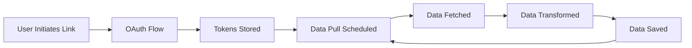

## Overview

This guide explains how to build custom provider integrations for new health devices or platforms. The provider system is designed to make adding new integrations straightforward while maintaining security and data quality.

<Info>
If you're looking to **use** existing providers like Garmin or Whoop, see [Using Providers](/providers/using-providers) instead.
</Info>

## Prerequisites

Before integrating a new provider, ensure you have:

<AccordionGroup>
  <Accordion title="Technical Requirements" icon="code">
    - Python 3.12+ environment
    - Access to the target device/service API documentation
    - OAuth credentials (OAuth 1.0 or OAuth 2.0) from the device vendor
    - Understanding of async/await patterns in Python
    - Familiarity with REST APIs and JSON data formats
  </Accordion>

  <Accordion title="OAuth Credentials" icon="key">
    Obtain OAuth credentials from the health device vendor:
    - **Client ID** / Consumer Key
    - **Client Secret** / Consumer Secret
    - **API endpoints** for authentication and data access
    - **OAuth scopes** required for health data access
  </Accordion>

  <Accordion title="Database Setup" icon="database">
    Your provider needs a dedicated table for raw data storage:

    ```sql
    CREATE TABLE IF NOT EXISTS theta_ai.health_data_<provider> (
        id SERIAL PRIMARY KEY,
        create_at TIMESTAMP DEFAULT CURRENT_TIMESTAMP,
        update_at TIMESTAMP DEFAULT CURRENT_TIMESTAMP,
        is_del BOOLEAN DEFAULT FALSE,
        msg_id VARCHAR(255) UNIQUE NOT NULL,
        raw_data JSONB NOT NULL,
        theta_user_id VARCHAR(255) NOT NULL,
        external_user_id VARCHAR(255)
    );
    
    CREATE INDEX idx_health_data_<provider>_theta_user_id 
        ON theta_ai.health_data_<provider>(theta_user_id);
    CREATE INDEX idx_health_data_<provider>_msg_id 
        ON theta_ai.health_data_<provider>(msg_id);
    ```
  </Accordion>
</AccordionGroup>

## Provider Architecture

### Directory Structure

```
connect/
├── __init__.py
└── theta/
    └── mirobody_<provider>/
        ├── __init__.py
        └── provider_<provider>.py
```

### Class Hierarchy

```
BaseThetaProvider (from mirobody.pulse.theta.platform.base)
    ↓
ThetaYourProvider (your implementation)
```

For complete implementation details, see the [Provider Integration Guide](https://github.com/thetahealth/mirobody-health/blob/main/connect/PROVIDER_INTEGRATION_GUIDE.md) in the repository.

## Quick Start

<Steps>
  <Step title="Create provider module">
    Create a new directory for your provider:

    ```bash
    mkdir -p connect/theta/mirobody_yourprovider
    touch connect/theta/mirobody_yourprovider/__init__.py
    touch connect/theta/mirobody_yourprovider/provider_yourprovider.py
    ```
  </Step>

  <Step title="Implement provider class">
    Create your provider class inheriting from `BaseThetaProvider`:

    ```python provider_yourprovider.py
    from mirobody.pulse.theta.platform.base import BaseThetaProvider
    from mirobody.pulse.theta.platform.indicator import StandardIndicator
    
    class ThetaYourProvider(BaseThetaProvider):
        """Your health device provider"""
        
        @classmethod
        def factory(cls, **configs):
            """Factory method for provider instantiation"""
            return cls()
        
        @classmethod
        def info(cls) -> ProviderInfo:
            """Provider metadata"""
            return ProviderInfo(
                slug="theta_yourprovider",
                name="Your Provider",
                description="Integration with Your Health Device"
            )
        
        # Implement required methods...
    ```
  </Step>

  <Step title="Configure OAuth">
    Add configuration to `config.yaml`:

    ```yaml
    YOURPROVIDER_CLIENT_ID: 'your_client_id'
    YOURPROVIDER_CLIENT_SECRET: 'your_client_secret'
    YOURPROVIDER_REDIRECT_URL: 'http://localhost:18080/api/v1/pulse/theta/theta_yourprovider/callback'
    ```
  </Step>

  <Step title="Test your provider">
    Test the OAuth flow and data fetching:

    ```bash
    # Start the application
    docker-compose up -d
    
    # Test OAuth link
    curl "http://localhost:18080/api/v1/pulse/theta/theta_yourprovider/link?user_id=test_user"
    ```
  </Step>
</Steps>

## Implementation Checklist

<AccordionGroup>
  <Accordion title="Required Methods" icon="list-check">
    Your provider must implement:

    - ✅ `factory()` - Provider instantiation
    - ✅ `info()` - Provider metadata
    - ✅ `link()` - Initiate OAuth flow
    - ✅ `callback()` - Handle OAuth callback
    - ✅ `unlink()` - Disconnect provider
    - ✅ `pull_from_vendor_api()` - Fetch data from API
    - ✅ `format_data()` - Transform to standard format
    - ✅ `save_raw_data_to_db()` - Persist raw data
    - ✅ `is_data_already_processed()` - Check for duplicates
  </Accordion>

  <Accordion title="OAuth Implementation" icon="key">
    Choose OAuth version based on provider requirements:

    **OAuth 1.0** (e.g., Garmin):
    - Request token
    - User authorization
    - Access token exchange

    **OAuth 2.0** (e.g., Whoop):
    - Authorization code
    - Token exchange
    - Token refresh handling

    See [OAuth Implementation](/development/oauth-implementation) for detailed examples.
  </Accordion>

  <Accordion title="Data Mapping" icon="arrows-rotate">
    Map vendor-specific data to standard indicators:

    ```python
    PROVIDER_INDICATOR_MAPPING = {
        "daily_steps": StandardIndicator.DAILY_STEPS,
        "sleep_time": StandardIndicator.DAILY_SLEEP_DURATION,
        "heart_rate": StandardIndicator.HEART_RATE,
    }
    ```

    See [Data Mapping](/development/data-mapping) for transformation patterns.
  </Accordion>

  <Accordion title="Testing" icon="flask">
    Test your provider thoroughly:

    - Unit tests for each method
    - OAuth flow integration tests
    - Data transformation tests
    - Error handling tests

    See [Provider Testing](/development/provider-testing) for guidelines.
  </Accordion>
</AccordionGroup>

## Key Concepts

### Provider Lifecycle



### Data Flow

1. **Raw Data Fetch**: Pull data from vendor API
2. **Raw Data Storage**: Save to provider-specific table
3. **Transformation**: Convert to standard indicators
4. **Standard Storage**: Save to `th_series_data` table
5. **Deduplication**: Skip already-processed records

## Configuration

Add provider configuration to `config.yaml`:

```yaml config.yaml
# OAuth Settings
YOURPROVIDER_CLIENT_ID: 'your_client_id'
YOURPROVIDER_CLIENT_SECRET: 'your_client_secret'
YOURPROVIDER_REDIRECT_URL: 'http://localhost:18080/api/v1/pulse/theta/theta_yourprovider/callback'

# Optional: API Endpoints
YOURPROVIDER_AUTH_URL: 'https://auth.yourprovider.com'
YOURPROVIDER_TOKEN_URL: 'https://api.yourprovider.com/token'
YOURPROVIDER_API_BASE_URL: 'https://api.yourprovider.com/v1'

# Optional: OAuth Scopes
YOURPROVIDER_SCOPES: 'read:health read:profile'

# Optional: Performance
YOURPROVIDER_REQUEST_TIMEOUT: 30
YOURPROVIDER_CONCURRENT_REQUESTS: 5
```

## Example: Minimal Provider

Here's a minimal provider implementation:

```python
from mirobody.pulse.theta.platform.base import BaseThetaProvider, ProviderInfo
from mirobody.pulse.theta.platform.indicator import StandardIndicator
from typing import Dict, List

class ThetaSimpleProvider(BaseThetaProvider):
    """Simple example provider"""
    
    @classmethod
    def factory(cls, **configs):
        return cls()
    
    @classmethod
    def info(cls) -> ProviderInfo:
        return ProviderInfo(
            slug="theta_simple",
            name="Simple Provider",
            description="Example provider integration"
        )
    
    async def link(self, user_id: str, return_url: str = None) -> Dict:
        """Initiate OAuth flow"""
        # Generate OAuth URL
        auth_url = self._build_auth_url(user_id)
        return {"link_web_url": auth_url}
    
    async def callback(self, user_id: str, **params) -> Dict:
        """Handle OAuth callback"""
        # Exchange code for tokens
        tokens = await self._exchange_token(params.get("code"))
        # Store tokens securely
        await self._store_tokens(user_id, tokens)
        return {"success": True}
    
    async def unlink(self, user_id: str) -> Dict:
        """Disconnect provider"""
        await self._delete_tokens(user_id)
        return {"success": True}
    
    async def pull_from_vendor_api(self, user_id: str) -> List[Dict]:
        """Fetch data from provider API"""
        tokens = await self._get_tokens(user_id)
        # Call vendor API
        data = await self._api_call("/user/health", tokens)
        return data
    
    def format_data(self, raw_data: Dict) -> List[StandardPulseData]:
        """Transform to standard format"""
        return [
            StandardPulseData(
                indicator=StandardIndicator.DAILY_STEPS,
                value=str(raw_data["steps"]),
                start_time=raw_data["date"],
                end_time=raw_data["date"]
            )
        ]
```

<Tip>
See [Garmin Provider Example](/examples/garmin-provider) and [Whoop Provider Example](/examples/whoop-provider) for complete implementations.
</Tip>

## Detailed Documentation

For comprehensive implementation details, refer to these guides:

<CardGroup cols={2}>
  <Card title="OAuth Implementation" icon="key" href="/development/oauth-implementation">
    Implement OAuth 1.0 or 2.0 flows
  </Card>
  <Card title="Data Mapping" icon="arrows-rotate" href="/development/data-mapping">
    Transform vendor data to standard format
  </Card>
  <Card title="Provider Testing" icon="flask" href="/development/provider-testing">
    Test your provider integration
  </Card>
  <Card title="Full Integration Guide" icon="book" href="https://github.com/thetahealth/mirobody-health/blob/main/connect/PROVIDER_INTEGRATION_GUIDE.md">
    Complete guide in repository
  </Card>
</CardGroup>

## Standard Health Indicators

Map your provider's data to these standard indicators:

| Indicator | Description | Unit |
|-----------|-------------|------|
| `DAILY_STEPS` | Daily step count | steps |
| `DAILY_SLEEP_DURATION` | Total sleep time | milliseconds |
| `HEART_RATE` | Heart rate measurement | bpm |
| `DAILY_HEART_RATE_RESTING` | Resting heart rate | bpm |
| `HRV` | Heart rate variability | ms |
| `WEIGHT` | Body weight | grams |
| `DAILY_CALORIES_ACTIVE` | Active calories burned | kcal |
| `SLEEP_EFFICIENCY` | Sleep efficiency | percentage |

See [Standard Indicators](/providers/overview#standard-health-indicators) for the complete list.

## Contributing Your Provider

Once you've built a provider, consider contributing it back:

<Steps>
  <Step title="Test thoroughly">
    Ensure all OAuth flows work and data transforms correctly
  </Step>

  <Step title="Document your provider">
    Add configuration instructions and supported metrics
  </Step>

  <Step title="Submit pull request">
    Follow the [Contributing Guide](/development/contributing)
  </Step>
</Steps>

<Note>
See the [complete Provider Integration Guide](https://github.com/thetahealth/mirobody-health/blob/main/connect/PROVIDER_INTEGRATION_GUIDE.md) in the repository for detailed implementation instructions, including all required methods, OAuth patterns, data transformation examples, and best practices.
</Note>

## Next Steps

<CardGroup cols={2}>
  <Card title="OAuth Implementation" icon="key" href="/development/oauth-implementation">
    Learn OAuth 1.0 and 2.0 flows
  </Card>
  <Card title="Data Mapping" icon="arrows-rotate" href="/development/data-mapping">
    Transform vendor data
  </Card>
  <Card title="Provider Testing" icon="flask" href="/development/provider-testing">
    Test your integration
  </Card>
  <Card title="Examples" icon="code" href="/examples/garmin-provider">
    See real provider code
  </Card>
</CardGroup>
