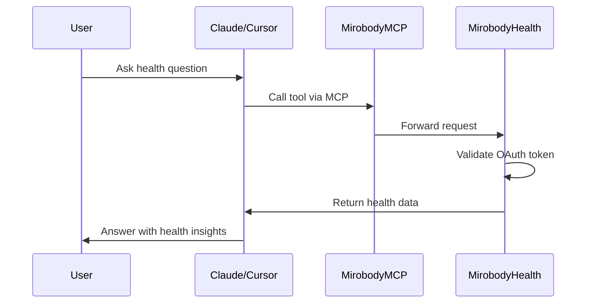

## Overview

Mirobody Health functions as an **OAuth-enabled MCP Server** that exposes all your tools to AI clients like Claude Desktop, Cursor, and custom MCP clients.

<Info>
The Model Context Protocol (MCP) is a standard interface for AI applications to access tools, resources, and context.
</Info>

## MCP Configuration

### For Claude Desktop & Cursor

Add Mirobody Health to your MCP configuration:

```json ~/Library/Application Support/Claude/claude_desktop_config.json
{
  "mcpServers": {
    "mirobody_mcp": {
      "command": "npx",
      "args": [
        "-y",
        "universal-mcp-proxy"
      ],
      "env": {
        "UMCP_ENDPOINT": "http://localhost:18080/mcp"
      }
    }
  }
}
```

<Tabs>
  <Tab title="macOS/Linux">
    Configuration file location:
    ```bash
    ~/Library/Application Support/Claude/claude_desktop_config.json
    ```

    For Cursor:
    ```bash
    ~/.cursor/mcp_config.json
    ```
  </Tab>

  <Tab title="Windows">
    Configuration file location:
    ```powershell
    %APPDATA%\Claude\claude_desktop_config.json
    ```

    For Cursor:
    ```powershell
    %USERPROFILE%\.cursor\mcp_config.json
    ```
  </Tab>
</Tabs>

### Restart Your Client

After updating the configuration:

<Steps>
  <Step title="Save configuration file">
    Ensure your changes are saved to the MCP config file
  </Step>

  <Step title="Restart Claude/Cursor">
    Close and reopen Claude Desktop or Cursor completely
  </Step>

  <Step title="Verify connection">
    The MCP server should appear in the client's MCP servers list

    In Claude Desktop: Click the MCP icon to see connected servers
    
    In Cursor: Check MCP status in settings
  </Step>

  <Step title="Test a tool">
    Try using one of your tools:
    
    "Can you show me my health profile?"
    
    The agent should call the `get_user_health_profile` tool.
  </Step>
</Steps>

<Check>
You should see your Mirobody Health tools available in the AI client!
</Check>

## Authentication Flow

When using tools through MCP clients, OAuth authentication is handled automatically:



<Note>
The OAuth token is managed by Mirobody Health. Users authenticate once, and tools have secure access to their data.
</Note>

## Available Endpoints

The MCP server exposes the following endpoint:

**Base URL**: `http://localhost:18080/mcp`

**Protocol**: JSON-RPC 2.0

**Methods**:
- `tools/list`: List all available tools
- `tools/call`: Execute a specific tool
- `resources/list`: List available resources
- `resources/read`: Read a resource

## For ChatGPT

Mirobody Health can also function as a GPT app, enabling capabilities within ChatGPT.

<Info>
ChatGPT integration documentation coming soon. The GPT app will allow ChatGPT users to access their health data through conversation.
</Info>

## Custom MCP Clients

### Direct HTTP Requests

You can call tools directly via HTTP:

```bash
# List all tools
curl -X POST http://localhost:18080/mcp \
  -H "Content-Type: application/json" \
  -d '{
    "jsonrpc": "2.0",
    "id": 1,
    "method": "tools/list"
  }'

# Call a tool
curl -X POST http://localhost:18080/mcp \
  -H "Content-Type: application/json" \
  -H "Authorization: Bearer YOUR_TOKEN" \
  -d '{
    "jsonrpc": "2.0",
    "id": 2,
    "method": "tools/call",
    "params": {
      "name": "get_user_health_profile",
      "arguments": {}
    }
  }'
```

## Next Steps

<CardGroup cols={2}>
  <Card title="Built-in Tools" icon="wrench" href="/tools/built-in">
    Explore default health tools
  </Card>
  <Card title="Add Custom Tools" icon="plus" href="/tools/adding-tools">
    Create your own tools
  </Card>
  <Card title="MCP API Reference" icon="book" href="/api-reference/mcp/overview">
    Detailed MCP protocol documentation
  </Card>
</CardGroup>
