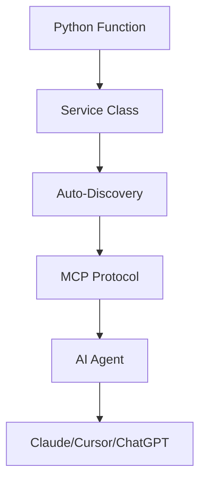

## What are Tools?

Tools are Python functions that enable AI agents to interact with health data, perform actions, and access external services. Mirobody Health's tool system makes it incredibly easy to add custom functionality without complex configuration.

<Info>
Tools are automatically discovered from the `tools/` directory in your project root and exposed via the MCP protocol.
</Info>

## Tool Architecture



<CardGroup cols={3}>
  <Card title="Simple to Add" icon="plus">
    Write Python functions - no JSON schemas required
  </Card>
  <Card title="Auto-Discovery" icon="magnifying-glass">
    Tools are automatically detected and registered
  </Card>
  <Card title="MCP Native" icon="bolt">
    Instantly available via Model Context Protocol
  </Card>
</CardGroup>

## Built-in Tools

Mirobody Health includes two essential health tools out of the box:

### 1. get_user_health_profile

Retrieves comprehensive user health profile information.

```python
async def get_user_health_profile(user_info: UserInfo) -> Dict:
    """
    Get user health profile including connected devices and summary data
    
    Args:
        user_info: User authentication information (automatically provided)
        
    Returns:
        Dict containing user profile, connected providers, and health summary
    """
    pass
```

**Returns:**
- User profile information
- Connected health devices/providers
- Health data summary and statistics

### 2. get_health_indicator

Retrieves specific health indicators for analysis.

```python
async def get_health_indicator(
    user_info: UserInfo,
    indicator: str,
    start_time: Optional[str] = None,
    end_time: Optional[str] = None
) -> List[Dict]:
    """
    Get health indicator data for a specific metric
    
    Args:
        user_info: User authentication information (automatically provided)
        indicator: Health indicator name (e.g., "HEART_RATE", "STEPS")
        start_time: Optional start time filter (ISO format)
        end_time: Optional end time filter (ISO format)
        
    Returns:
        List of health indicator records
    """
    pass
```

**Use Cases:**
- Query heart rate data over time
- Retrieve sleep patterns
- Analyze activity trends
- Compare biomarkers

<Tip>
These built-in tools query the `theta_ai.th_series_data` table which contains all standardized health indicators.
</Tip>

## Tool Categories

<Tabs>
  <Tab title="User Data Tools">
    **Private data tools** that require authentication:
    - Access user's health indicators
    - Query personal profiles
    - Retrieve device data
    - Analyze personal trends
    
    **Requirements:**
    - Must include `user_info: UserInfo` parameter
    - OAuth authentication enforced automatically
    - Data scoped to authenticated user only
  </Tab>

  <Tab title="Public Data Tools">
    **Public tools** that don't require user authentication:
    - Search health literature
    - Access public health databases
    - Perform calculations
    - Web searches
    
    **Requirements:**
    - No `user_info` parameter needed
    - No authentication required
    - Can access public data sources
  </Tab>
</Tabs>

## How Tools Work

<Steps>
  <Step title="Tool Discovery">
    On startup, Mirobody Health scans the `tools/` directory for Python files containing Service classes.
    
    ```python
    # tools/my_tool.py
    class MyToolService:
        # All public methods become tools
        pass
    ```
  </Step>

  <Step title="Auto-Registration">
    Each public method in a Service class is automatically registered as a tool.
    
    ```python
    class WeatherService:
        async def get_weather(self, location: str) -> Dict:
            """Get weather for location"""
            # This becomes a tool automatically
            pass
    ```
  </Step>

  <Step title="MCP Exposure">
    Tools are exposed via the MCP protocol at `http://localhost:18080/mcp` for AI agents to discover and call.
  </Step>

  <Step title="Agent Invocation">
    AI agents (Claude, Cursor, ChatGPT) can discover and call your tools through the MCP interface.
  </Step>
</Steps>

## Tool Configuration

Tools are configured in `config.yaml`:

```yaml config.yaml
# Tool Directories
MCP_TOOL_DIRS:
  - mirobody/pub/tools    # Built-in tools
  - tools                 # Your custom tools

# Tool Access Control
ALLOWED_TOOLS_SYNERGY:
  - get_user_health_profile
  - get_health_indicator
  - your_custom_tool

DISALLOWED_TOOLS_SYNERGY:
  - dangerous_tool
```

<Warning>
Leave `ALLOWED_TOOLS_SYNERGY` empty to allow all tools by default. Use `DISALLOWED_TOOLS_SYNERGY` to block specific tools.
</Warning>

## Database Schema for Health Data

Tools can query standardized health data from these tables:

### theta_ai.th_series_data

Primary table for time-series health indicators:

| Column | Type | Description |
|--------|------|-------------|
| `id` | integer | Primary key |
| `user_id` | varchar | User identifier |
| `indicator` | varchar | Indicator code/name |
| `value` | text | Original indicator value |
| `value_standardized` | text | Standardized indicator value |
| `start_time` | timestamp | Indicator start time |
| `end_time` | timestamp | Indicator end time |
| `source` | varchar | Data source (system/device/manual) |
| `source_table` | varchar | Original source table |
| `source_table_id` | varchar | Source record ID |
| `indicator_id` | text | Unique indicator identifier |
| `deleted` | integer | Deletion flag (0: active, 1: deleted) |
| `create_time` | timestamptz | Creation timestamp |
| `update_time` | timestamptz | Last update timestamp |
| `task_id` | varchar | Task ID |
| `full_dim_id` | bigint | Full dimension ID |
| `fhir_id` | bigint | FHIR resource ID |
| `fhir_mapping_info` | jsonb | FHIR mapping information |
| `is_standardized` | boolean | Standardization flag |
| `comment` | text | Additional notes |

### theta_ai.health_user_profile_by_system

User profile storage:

| Column | Type | Description |
|--------|------|-------------|
| `id` | integer | Primary key |
| `user_id` | varchar | User identifier |
| `version` | integer | Version number |
| `name` | varchar | Profile name |
| `last_execute_doc_id` | integer | Last executed document ID |
| `common_part` | varchar | Profile content (JSON) |
| `create_time` | timestamp | Creation timestamp |
| `last_update_time` | timestamp | Last update timestamp |
| `is_deleted` | boolean | Deletion flag |

## Next Steps

<CardGroup cols={2}>
  <Card title="Built-in Tools" icon="wrench" href="/tools/built-in">
    Explore the default health tools
  </Card>
  <Card title="Adding Custom Tools" icon="plus" href="/tools/adding-tools">
    Learn how to create your own tools
  </Card>
  <Card title="MCP Integration" icon="bolt" href="/tools/mcp-integration">
    Connect tools to Claude, Cursor, and ChatGPT
  </Card>
  <Card title="Tool Examples" icon="code" href="/tools/examples">
    See real tool implementations
  </Card>
</CardGroup>
