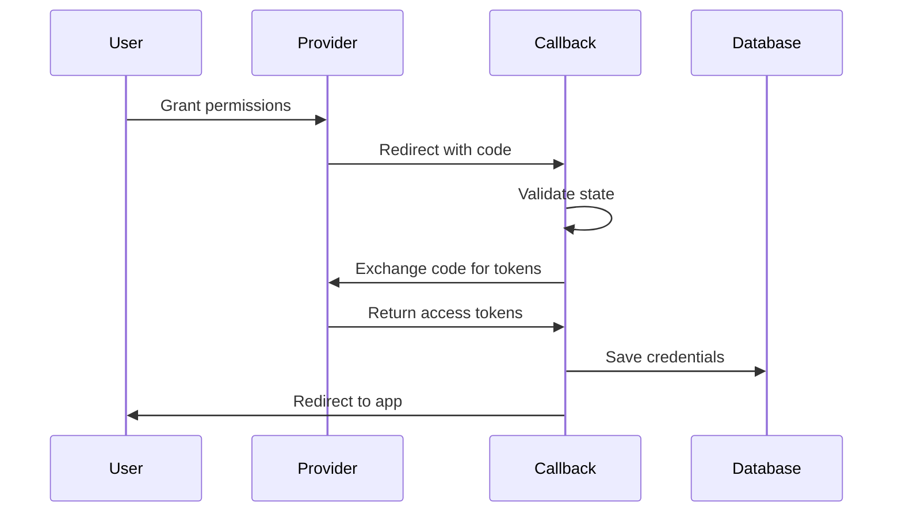

## Endpoint

```
GET /api/v1/pulse/theta/{provider_slug}/callback
```

## Overview

用户授权后，该 endpoint 会被健康 provider 调用。它通过将授权码交换为 access tokens 来完成 OAuth flow，并保存凭据。

<Warning>
该 endpoint 会由 provider 的 OAuth redirect 自动触发，你不需要在应用中直接调用它。
</Warning>

## How It Works

当用户在 provider 网站完成授权后，provider 会携带授权码重定向回此 callback URL。随后 Mirobody Health 会：

1. 校验 OAuth state 参数
2. 将授权码交换为 access tokens
3. 将加密后的凭据保存到数据库
4. 触发首次数据同步
5. （如果提供了 `return_url`）重定向用户

## OAuth 2.0 Callback Parameters

<ParamField query="code" type="string" required>
  provider 返回的授权码
</ParamField>

<ParamField query="state" type="string" required>
  用于 CSRF 防护的 state 参数
</ParamField>

## OAuth 1.0 Callback Parameters

<ParamField query="oauth_token" type="string" required>
  OAuth request token
</ParamField>

<ParamField query="oauth_verifier" type="string" required>
  OAuth verifier code
</ParamField>

## Callback Flow



## Response

处理完成后 callback 通常会重定向用户；如果被直接调用或发生错误，也可能返回 JSON：

<ResponseExample>
```json Success
{
  "provider_slug": "theta_garmin",
  "access_token": "abc123...",
  "stage": "completed"
}
```
</ResponseExample>

<ResponseExample>
```json Error
{
  "error": {
    "code": "INVALID_STATE",
    "message": "OAuth state parameter is invalid or expired"
  }
}
```
</ResponseExample>

## Troubleshooting

<AccordionGroup>
  <Accordion title="Invalid State Error" icon="triangle-exclamation">
    **Cause**: State parameter doesn't match or has expired

    **Solutions**:
    - 确保用户在 15 分钟内完成授权
    - 不要修改授权 URL
    - 检查 Redis 是否运行且可访问
  </Accordion>

  <Accordion title="Token Exchange Failed" icon="key">
    **Cause**: Provider rejected the code exchange

    **Solutions**:
    - 确认 OAuth 凭据是否正确
    - 检查 redirect URI 是否与 provider 配置一致
    - 确认授权码未过期（通常 10 分钟）
  </Accordion>

  <Accordion title="Redirect Loop" icon="rotate">
    **Cause**: Callback URL misconfigured

    **Solutions**:
    - 检查 provider 开发者门户中的 callback URL
    - 检查 redirect URL 配置是否有拼写错误
    - 确保 URL 协议一致（http vs https）
  </Accordion>
</AccordionGroup>

<Note>
该 endpoint 需要在各 provider 的开发者门户中配置为 OAuth callback URL。URL 格式为：

```
http://localhost:18080/api/v1/pulse/theta/{provider_slug}/callback
```

生产环境请替换为你的 production domain。
</Note>
