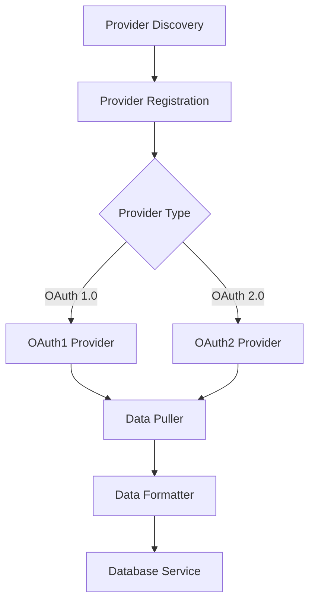
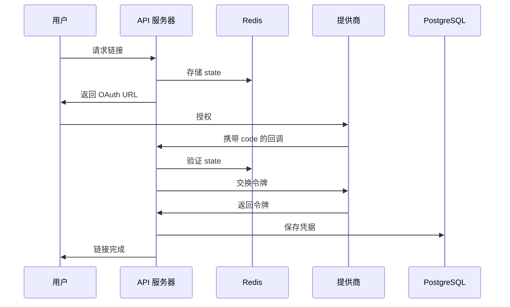
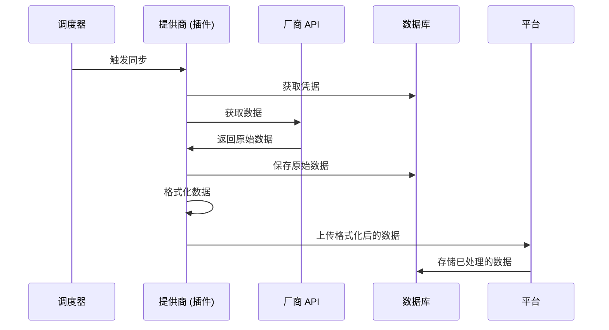

## 系统架构

Mirobody Health 采用模块化、分层架构，将关注点分离，并支持轻松扩展。

## 核心组件

<CardGroup cols={2}>
  <Card title="API 层" icon="server">
    基于 FastAPI 的 REST API，用于对外集成
  </Card>
  <Card title="提供商系统" icon="plug">
    面向健康设备的可插拔 OAuth 集成
  </Card>
  <Card title="数据流水线" icon="arrow-progress">
    健康数据转换的 ETL 流水线
  </Card>
  <Card title="AI 服务" icon="brain">
    面向对话的多 LLM 提供商集成
  </Card>
  <Card title="MCP 协议" icon="bolt">
    面向 AI agent 的 Model Context Protocol
  </Card>
  <Card title="存储层" icon="database">
    PostgreSQL 与 Redis 用于数据持久化
  </Card>
</CardGroup>

## 架构分层

### 1. API 层

API 层为系统交互提供 RESTful 端点（endpoints）：

```
HTTP Server (FastAPI)
├── /api/v1/pulse/          # 健康提供商端点
├── /api/chat               # AI 聊天接口
├── /api/history            # 会话历史
└── /mcp                    # MCP 协议端点
```

**核心特性:**
- 使用 FastAPI 进行异步请求处理
- 自动生成 API 文档（OpenAPI/Swagger）
- 为 Web 客户端提供 CORS 支持
- 使用 Pydantic 模型进行请求校验
- 基于 JWT 的身份验证

### 2. 提供商系统

面向健康设备集成的可插拔架构：



**组件:**
- `BaseThetaProvider`: 所有提供商的抽象基类
- `ThetaDataFormatter`: 标准数据转换工具
- `ThetaTimeUtils`: 时区和时间戳处理
- 提供商特定实现（Garmin, Whoop 等）

### 3. 数据流水线 (TBD)

健康数据的 ETL（提取、转换、加载）流水线：

```
┌─────────────┐
│  Pull Data  │ ─┐
└─────────────┘  │
                 │
┌─────────────┐  │  ┌──────────────┐
│  Save Raw   │ ◄┴─▶│ Push Service │
└─────────────┘     └──────────────┘
        │                   │
        ▼                   ▼
┌─────────────┐    ┌──────────────┐
│  Format     │    │  Upload      │
└─────────────┘    └──────────────┘
        │                   │
        ▼                   ▼
┌─────────────┐    ┌──────────────┐
│ Standardize │    │  Platform    │
└─────────────┘    └──────────────┘
```

**流程:**
1. **Pull (拉取)**：从厂商 API 获取数据
2. **Save (保存)**：将原始数据存入数据库
3. **Format (格式化)**：转换为标准格式
4. **Upload (上传)**：推送到 Mirobody 平台

### 4. AI 服务

面向智能健康洞察的多 LLM 提供商集成：

```python
AI Services
├── OpenRouter (多模型)
├── OpenAI 
├── Google
├── Anthropic
└── 本地 LLM (即将推出)
```

**特性:**
- 与提供商无关的接口
- 对话上下文管理
- 用于健康数据访问的工具调用 (Tool calling)
- 会话历史持久化

### 5. MCP 协议

支持通过 Model Context Protocol 集成 AI agent：

```
MCP Server
├── Tools/        # 可用工具
│   ├── get_user_health_profile
│   ├── get_health_indicator
│   ├── genetic_service
│   └── 您的自定义工具
├── Resources/    # 可用资源
```

**能力:**
- JSON-RPC 2.0 接口
- 工具发现与执行
- 资源管理
- Agent 编排

### 6. 存储层

面向不同数据类型的双存储系统：

<Tabs>
  <Tab title="PostgreSQL">
    **用于:**
    - 用户凭据（加密）
    - OAuth 令牌与刷新令牌
    - 健康原始数据（JSONB）
    - 提供商配置
    - 会话历史
  </Tab>

  <Tab title="Redis">
    **用于:**
    - OAuth state 参数（短期）
    - 会话令牌
    - 速率限制计数器
    - 缓存 API 响应
    - 临时数据存储

    **核心模式:**
    ```
    oauth2:state:{state}      # OAuth state
    oauth:secret:{token}      # OAuth 1.0 secrets
    cache:user:{user_id}      # 用户数据缓存
    rate:{provider}:{user}    # 速率限制
    ```
  </Tab>
</Tabs>

## 数据流

### OAuth 身份验证流程



### 健康数据同步



## 设计模式

### 插件架构

提供商是动态发现并加载的：

```python
# 提供商发现
THETA_PROVIDER_DIRS = ["connect/theta"]

# 自动加载
for directory in THETA_PROVIDER_DIRS:
    providers = discover_providers(directory)
    for provider_class in providers:
        provider = provider_class.create_provider(config)
        if provider:
            register_provider(provider)
```

### 工厂模式

提供商使用工厂方法进行有条件的实例化：

```python
@classmethod
def create_provider(cls, config: Dict) -> Optional['Provider']:
    """工厂方法 - 如果配置无效则返回 None"""
    if not cls._validate_config(config):
        return None
    return cls()
```

### 策略模式

针对 OAuth 1.0 vs 2.0 的不同 OAuth 策略：

```python
class BaseThetaProvider:
    def link(self, request) -> Dict:
        """由 OAuth1 或 OAuth2 策略实现"""
        pass
    
    def callback(self, *args, **kwargs) -> Dict:
        """由 OAuth1 或 OAuth2 策略实现"""
        pass
```

### 仓库模式

通过服务抽象数据库操作：

```python
class DatabaseService:
    async def save_oauth2_credentials(self, ...): pass
    async def get_user_credentials(self, ...): pass
    async def delete_user_theta_provider(self, ...): pass
```

## 安全架构

<AccordionGroup>
  <Accordion title="身份验证与授权" icon="key">
    - 基于 JWT 的 API 身份验证
    - 用于提供商访问的 OAuth 1.0/2.0
    - 加密存储凭据
    - 按用户隔离的提供商访问控制
  </Accordion>

  <Accordion title="数据保护" icon="shield">
    - 数据库级别加密
    - 加密 OAuth 令牌
    - 所有外部通信使用 HTTPS
    - 敏感数据绝不记录到日志
  </Accordion>

  <Accordion title="访问控制" icon="lock">
    - 用户范围的数据访问
    - 提供商特定的权限
    - API 速率限制
    - CORS 策略
  </Accordion>

  <Accordion title="安全通信" icon="shield-halved">
    - 外部 API 使用 TLS/SSL
    - 针对 OAuth CSRF 保护的 state 参数
    - 令牌刷新机制
    - 安全的会话管理
  </Accordion>
</AccordionGroup>

## 可扩展性考虑

### 水平扩展

系统支持水平扩展：

<CardGroup cols={2}>
  <Card title="无状态 API" icon="server">
    API 服务器是无状态的，可在负载均衡器后实现水平扩展
  </Card>
  <Card title="分布式缓存" icon="layer-group">
    Redis 支持集群，用于分布式缓存
  </Card>
  <Card title="数据库连接池" icon="database">
    连接池支持多个 API 实例并发访问
  </Card>
  <Card title="异步处理" icon="arrows-spin">
    Async/await 提升了每个实例的并发处理能力
  </Card>
</CardGroup>


## 部署架构

### Docker Compose 架构

```yaml
services:
  backend:
    image: mirobody-backend
    ports: ["18080:18080"]
    depends_on: [db, redis]
    
  db:
    image: postgres:15
    volumes: ["pgdata:/var/lib/postgresql/data"]
    
  redis:
    image: redis:7
    volumes: ["redis-data:/data"]

volumes:
  pgdata:
  redis-data:
```

## 监控与可观测性

### 日志

整个系统使用结构化日志：

```python
# 日志级别
LOG_LEVEL: INFO  # DEBUG, INFO, WARNING, ERROR, CRITICAL

# 上下文日志
logging.info(
    "Data pull completed",
    extra={
        "user_id": user_id,
        "provider": provider_slug,
        "records": len(data),
        "duration_ms": duration
    }
)
```

### 指标

追踪关键性能指标：

- 请求延迟
- 提供商成功率
- 数据处理吞吐量
- 按提供商分类的错误率
- 令牌刷新率

### 健康检查

```python
GET /health
{
  "status": "healthy",
  "version": "1.0.1",
  "services": {
    "database": "connected",
    "redis": "connected"
  }
}
```

## 技术栈

<Tabs>
  <Tab title="后端">
    - **Python 3.12+**: 核心语言
    - **FastAPI**: Web 框架
    - **asyncio**: 异步 I/O
    - **Pydantic**: 数据校验
    - **SQLAlchemy**: 数据库 ORM
  </Tab>

  <Tab title="存储">
    - **PostgreSQL 15**: 关系型数据库
    - **Redis 7**: 缓存与会话存储
    - **JSONB**: 灵活的数据存储
    - **S3 (可选)**: 对象存储
  </Tab>

  <Tab title="集成">
    - **aiohttp**: 异步 HTTP 客户端
    - **requests-oauthlib**: OAuth 1.0
    - **OAuth 2.0**: 现代认证
    - **JSON-RPC 2.0**: MCP 协议
  </Tab>

  <Tab title="DevOps">
    - **Docker**: 容器化
    - **Docker Compose**: 本地部署
    - **pytest**: 测试框架
    - **GitHub Actions**: CI/CD
  </Tab>
</Tabs>

## 扩展点

该架构提供了多个扩展点：

<AccordionGroup>
  <Accordion title="新增提供商" icon="plus">
    新增健康设备集成请参见[开发](/zh/development/setup)：
  </Accordion>

  <Accordion title="工具与 MCP" icon="wrench">
    1. 请参阅[添加自定义工具](/zh/tools/adding-tools)以为 AI agent 添加新工具
    2. 请参阅[添加自定义 MCP](/zh/tools/adding-mcps)以为 AI agent 添加新 MCP
  </Accordion>

  <Accordion title="自定义指标" icon="chart-line">
    添加新的健康指标：
    1. 在 `StandardIndicator` 枚举中定义
    2. 指定标准单位
    3. 更新提供商映射
  </Accordion>

  <Accordion title="AI 提供商" icon="robot">
    添加新的 LLM 提供商：
    1. 实现提供商接口
    2. 添加配置
    3. 在 agent 系统中注册
    4. 部署
  </Accordion>
</AccordionGroup>

## 最佳实践

<CardGroup cols={2}>
  <Card title="关注点分离" icon="layer-group">
    每一层只负责单一职责
  </Card>
  <Card title="依赖注入" icon="syringe">
    通过注入使用服务，而非硬编码
  </Card>
  <Card title="面向接口设计" icon="cube">
    面向接口编程，而非面向实现
  </Card>
  <Card title="配置驱动" icon="gears">
    行为通过配置控制
  </Card>
  <Card title="异步优先" icon="bolt">
    所有 I/O 操作使用 Async/await
  </Card>
  <Card title="错误处理" icon="triangle-exclamation">
    优雅降级与恢复
  </Card>
</CardGroup>

## 下一步

<CardGroup cols={2}>
  <Card title="提供商系统" icon="plug" href="/zh/concepts/providers">
    深入了解提供商系统
  </Card>
  <Card title="数据流" icon="arrow-progress" href="/zh/concepts/data-flow">
    理解数据转换流程
  </Card>
  <Card title="开发设置" icon="code" href="/zh/development/setup">
    搭建您的开发环境
  </Card>
  <Card title="部署" icon="rocket" href="/zh/deployment/docker">
    部署 Mirobody Health
  </Card>
</CardGroup>
