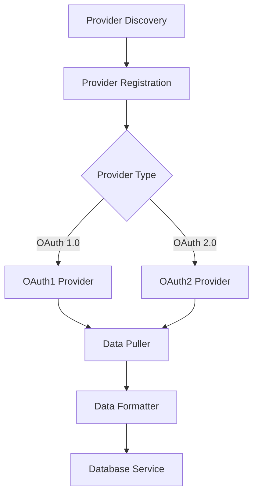
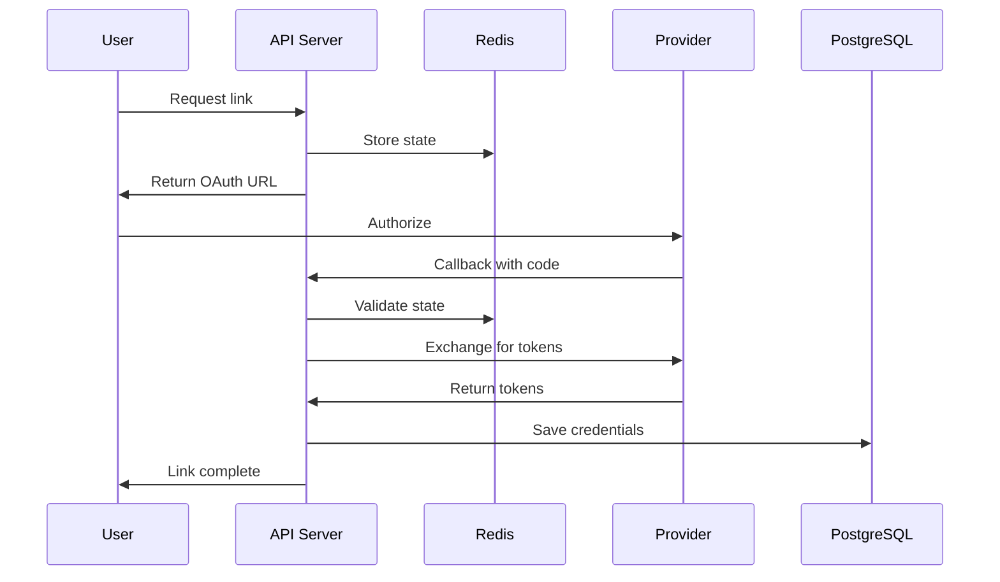
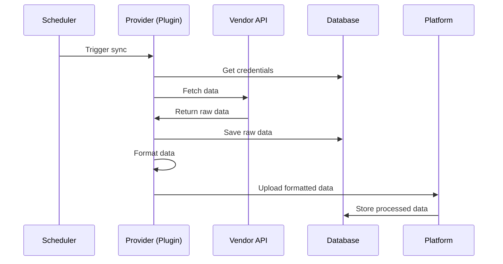

## 系统架构

Mirobody Health 采用模块化、分层架构，将关注点分离，并支持轻松扩展。

## 核心组件

<CardGroup cols={2}>
  <Card title="API Layer" icon="server">
    基于 FastAPI 的 REST API，用于对外集成
  </Card>
  <Card title="Provider System" icon="plug">
    面向健康设备的可插拔 OAuth 集成
  </Card>
  <Card title="Data Pipeline" icon="arrow-progress">
    健康数据转换的 ETL pipeline
  </Card>
  <Card title="AI Services" icon="brain">
    面向对话的多 LLM provider 集成
  </Card>
  <Card title="MCP Protocol" icon="bolt">
    面向 AI agents 的 Model Context Protocol
  </Card>
  <Card title="Storage Layer" icon="database">
    PostgreSQL 与 Redis 用于数据持久化
  </Card>
</CardGroup>

## 架构分层

### 1. API Layer

API Layer 为系统交互提供 RESTful endpoints：

```
HTTP Server (FastAPI)
├── /api/v1/pulse/          # Health provider endpoints
├── /api/chat               # AI chat interface
├── /api/history            # Session history
└── /mcp                    # MCP protocol endpoint
```

**Key Features:**
- 使用 FastAPI 进行异步请求处理
- 自动生成 API 文档（OpenAPI/Swagger）
- 为 Web clients 提供 CORS 支持
- 使用 Pydantic models 进行请求校验
- 基于 JWT 的认证

### 2. Provider System

面向健康设备集成的可插拔架构：



**Components:**
- `BaseThetaProvider`: Abstract base class for all providers
- `ThetaDataFormatter`: Standard data transformation utilities
- `ThetaTimeUtils`: Timezone and timestamp handling
- Provider-specific implementations (Garmin, Whoop, etc.)

### 3. Data Pipeline (TBD)

健康数据的 ETL（Extract, Transform, Load）pipeline：

```
┌─────────────┐
│  Pull Data  │ ─┐
└─────────────┘  │
                 │
┌─────────────┐  │  ┌──────────────┐
│  Save Raw   │ ◄┴─▶│ Push Service │
└─────────────┘     └──────────────┘
        │                   │
        ▼                   ▼
┌─────────────┐    ┌──────────────┐
│  Format     │    │  Upload      │
└─────────────┘    └──────────────┘
        │                   │
        ▼                   ▼
┌─────────────┐    ┌──────────────┐
│ Standardize │    │  Platform    │
└─────────────┘    └──────────────┘
```

**Flow:**
1. **Pull**：从 vendor API 拉取数据
2. **Save**：将 raw 数据保存到数据库
3. **Format**：转换为标准格式
4. **Upload**：推送到 Mirobody platform

### 4. AI Services

面向智能健康洞察的多 LLM provider 集成：

```python
AI Services
├── OpenRouter (Multi-model)
├── OpenAI (coming later)
├── Google (coming later)
├── Anthropic (coming later)
└── Local LLMs (coming later)
```

**Features:**
- Provider-agnostic 接口（coming later）
- 对话上下文管理
- Tool calling（访问健康数据）
- 会话历史持久化

### 5. MCP Protocol

支持通过 Model Context Protocol 集成 AI agents：

```
MCP Server
├── Tools/        # Available tools
│   ├── get_user_health_profile
│   ├── get_health_indicator
│   └── your custom tools
├── Resources/    # Available resources
```

**Capabilities:**
- JSON-RPC 2.0 接口
- Tool 发现与执行
- Resource 管理
- Agent 编排

### 6. Storage Layer

面向不同数据类型的双存储系统：

<Tabs>
  <Tab title="PostgreSQL">
    **Used for:**
    - 用户凭据（加密）
    - OAuth tokens 与 refresh tokens
    - 健康 raw 数据（JSONB）
    - Provider 配置
    - 会话历史

  </Tab>

  <Tab title="Redis">
    **Used for:**
    - OAuth state 参数（短期）
    - Session tokens
    - Rate limiting 计数器
    - 缓存 API 响应
    - 临时数据存储

    **Key Patterns:**
    ```
    oauth2:state:{state}      # OAuth state
    oauth:secret:{token}      # OAuth 1.0 secrets
    cache:user:{user_id}      # User data cache
    rate:{provider}:{user}    # Rate limiting
    ```
  </Tab>
</Tabs>

## Data Flow

### OAuth Authentication Flow



### Health Data Synchronization



## Design Patterns

### Plugin Architecture

Providers are discovered and loaded dynamically:

```python
# Provider discovery
THETA_PROVIDER_DIRS = ["connect/theta"]

# Automatic loading
for directory in THETA_PROVIDER_DIRS:
    providers = discover_providers(directory)
    for provider_class in providers:
        provider = provider_class.create_provider(config)
        if provider:
            register_provider(provider)
```

### Factory Pattern

Providers use factory methods for conditional instantiation:

```python
@classmethod
def create_provider(cls, config: Dict) -> Optional['Provider']:
    """Factory method - returns None if config invalid"""
    if not cls._validate_config(config):
        return None
    return cls()
```

### Strategy Pattern

Different OAuth strategies for OAuth 1.0 vs 2.0:

```python
class BaseThetaProvider:
    def link(self, request) -> Dict:
        """Implemented by OAuth1 or OAuth2 strategy"""
        pass
    
    def callback(self, *args, **kwargs) -> Dict:
        """Implemented by OAuth1 or OAuth2 strategy"""
        pass
```

### Repository Pattern

Database operations abstracted through services:

```python
class DatabaseService:
    async def save_oauth2_credentials(self, ...): pass
    async def get_user_credentials(self, ...): pass
    async def delete_user_theta_provider(self, ...): pass
```

## 安全架构

<AccordionGroup>
  <Accordion title="Authentication & Authorization" icon="key">
    - 基于 JWT 的 API 认证
    - OAuth 1.0/2.0（provider access）
    - 加密存储凭据
    - 按用户隔离的 provider 访问控制
  </Accordion>

  <Accordion title="Data Protection" icon="shield">
    - 数据库级别加密
    - 加密 OAuth tokens
    - 外部通信使用 HTTPS
    - 不记录敏感数据
  </Accordion>

  <Accordion title="Access Control" icon="lock">
    - 用户范围的数据访问
    - Provider 级权限控制
    - API rate limiting
    - CORS policies
  </Accordion>

  <Accordion title="Secure Communication" icon="shield-halved">
    - 外部 API 使用 TLS/SSL
    - OAuth state 参数防 CSRF
    - Token refresh 机制
    - 安全的 session 管理
  </Accordion>
</AccordionGroup>

## 可扩展性考虑

### Horizontal Scaling

系统支持水平扩展：

<CardGroup cols={2}>
  <Card title="Stateless API" icon="server">
    API servers 无状态，可在负载均衡后水平扩展
  </Card>
  <Card title="Distributed Cache" icon="layer-group">
    Redis 支持集群，用于分布式缓存
  </Card>
  <Card title="Database Pooling" icon="database">
    连接池支持多实例 API 并发访问数据库
  </Card>
  <Card title="Async Processing" icon="arrows-spin">
    async/await 提升单实例并发能力
  </Card>
</CardGroup>


## Deployment Architecture

### Docker Compose Architecture

```yaml
services:
  backend:
    image: mirobody-backend
    ports: ["18080:18080"]
    depends_on: [db, redis]
    
  db:
    image: postgres:15
    volumes: ["pgdata:/var/lib/postgresql/data"]
    
  redis:
    image: redis:7
    volumes: ["redis-data:/data"]

volumes:
  pgdata:
  redis-data:
```

## Monitoring & Observability

### Logging

Structured logging throughout the system:

```python
# Log levels
LOG_LEVEL: INFO  # DEBUG, INFO, WARNING, ERROR, CRITICAL

# Contextual logging
logging.info(
    "Data pull completed",
    extra={
        "user_id": user_id,
        "provider": provider_slug,
        "records": len(data),
        "duration_ms": duration
    }
)
```

### Metrics

Track key performance indicators:

- Request latency
- Provider success rates
- Data processing throughput
- Error rates by provider
- Token refresh rates

### Health Checks

```python
GET /health
{
  "status": "healthy",
  "version": "1.0.1",
  "services": {
    "database": "connected",
    "redis": "connected"
  }
}
```

## Technology Stack

<Tabs>
  <Tab title="Backend">
    - **Python 3.12+**: Core language
    - **FastAPI**: Web framework
    - **asyncio**: Async I/O
    - **Pydantic**: Data validation
    - **SQLAlchemy**: Database ORM
  </Tab>

  <Tab title="Storage">
    - **PostgreSQL 15**: Relational database
    - **Redis 7**: Cache and session store
    - **JSONB**: Flexible data storage
    - **S3 (optional)**: Object storage
  </Tab>

  <Tab title="Integration">
    - **aiohttp**: Async HTTP client
    - **requests-oauthlib**: OAuth 1.0
    - **OAuth 2.0**: Modern auth
    - **JSON-RPC 2.0**: MCP protocol
  </Tab>

  <Tab title="DevOps">
    - **Docker**: Containerization
    - **Docker Compose**: Local deployment
    - **pytest**: Testing framework
    - **GitHub Actions**: CI/CD
  </Tab>
</Tabs>

## 扩展点

该架构提供多个扩展点：

<AccordionGroup>
  <Accordion title="New Providers" icon="plus">
    新增健康设备集成请参见[开发](/zh/development/setup)：
  </Accordion>

  <Accordion title="Tools & MCPs" icon="wrench">
    1. See [Adding Custom Tools](/zh/tools/adding-tools) to add new tools for AI agents
    2. See [Adding Custom MCPs](/zh/tools/adding-mcps) to add new MCPs for AI agents
  </Accordion>

  <Accordion title="Custom Indicators" icon="chart-line">
    添加新的健康指标：
    1. Define in `StandardIndicator` enum
    2. Specify standard unit
    3. Update provider mappings
  </Accordion>

  <Accordion title="AI Providers" icon="robot">
    添加新的 LLM providers：
    1. Implement provider interface
    2. Add configuration
    3. Register in agent system
    4. Deploy
  </Accordion>
</AccordionGroup>

## 最佳实践

<CardGroup cols={2}>
  <Card title="Separation of Concerns" icon="layer-group">
    每一层只负责单一职责
  </Card>
  <Card title="Dependency Injection" icon="syringe">
    通过依赖注入使用 services，而不是硬编码
  </Card>
  <Card title="Interface-Based Design" icon="cube">
    面向接口编程，而非面向实现
  </Card>
  <Card title="Configuration-Driven" icon="gears">
    行为通过配置驱动
  </Card>
  <Card title="Async First" icon="bolt">
    所有 I/O 使用 async/await
  </Card>
  <Card title="Error Handling" icon="triangle-exclamation">
    优雅降级与恢复
  </Card>
</CardGroup>

## 下一步

<CardGroup cols={2}>
  <Card title="Provider System" icon="plug" href="/zh/concepts/providers">
    深入了解 provider 系统
  </Card>
  <Card title="Data Flow" icon="arrow-progress" href="/zh/concepts/data-flow">
    理解数据转换流程
  </Card>
  <Card title="Development Setup" icon="code" href="/zh/development/setup">
    搭建开发环境
  </Card>
  <Card title="Deployment" icon="rocket" href="/zh/deployment/docker">
    部署 Mirobody Health
  </Card>
</CardGroup>
