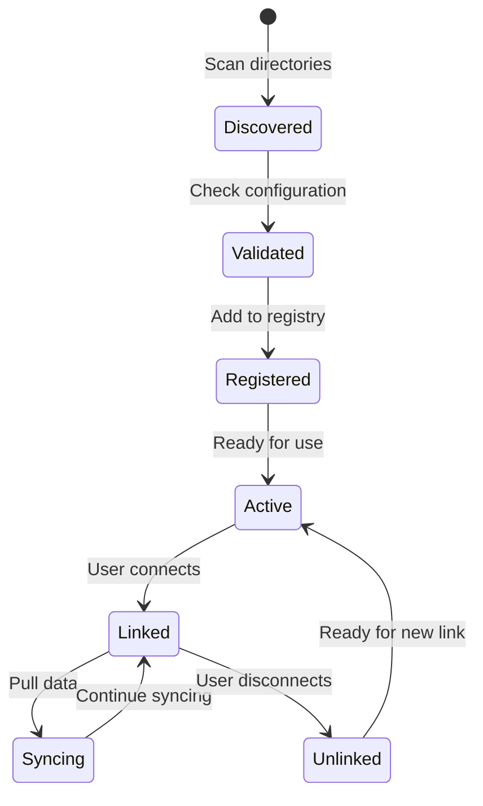

## Provider 系统概览

Provider 系统是 Mirobody Health 的核心：通过统一接口实现与各种健康设备 API 的无缝集成。

<Info>
Provider 系统采用插件式架构，无需修改核心代码即可添加新的集成。
</Info>

## 关键概念

<CardGroup cols={2}>
  <Card title="Provider" icon="plug">
    用于集成特定健康设备 API（例如 Garmin、Whoop）的插件
  </Card>
  <Card title="BaseThetaProvider" icon="cube">
    所有 providers 必须继承的抽象基类
  </Card>
  <Card title="Provider Discovery" icon="magnifying-glass">
    从配置目录中自动发现并加载 provider 插件
  </Card>
  <Card title="Provider Registry" icon="list">
    所有可用/已启用 providers 的中央注册表
  </Card>
</CardGroup>

## Provider 生命周期

更多细节请参见 [Provider 概览](/zh/providers/overview)。
