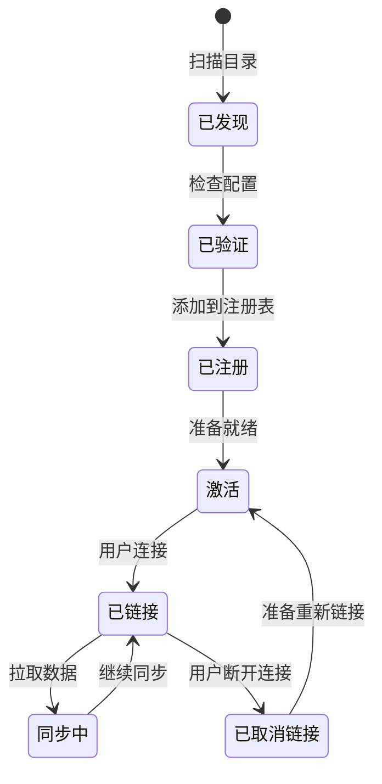

## 提供商系统概览

提供商（Provider）系统是 Mirobody Health 的核心，通过标准化接口实现与各种健康设备 API 的无缝集成。

<Info>
提供商系统遵循插件化架构，可以轻松添加新的集成，而无需修改核心代码。
</Info>

## 核心概念

<CardGroup cols={2}>
  <Card title="提供商 (Provider)" icon="plug">
    与特定健康设备 API（如 Garmin, Whoop）集成的插件
  </Card>
  <Card title="BaseThetaProvider" icon="cube">
    所有提供商必须继承的抽象基类
  </Card>
  <Card title="提供商发现" icon="magnifying-glass">
    从配置目录中自动检测并加载提供商插件
  </Card>
  <Card title="提供商注册表" icon="list">
    所有可用且激活的提供商的中央注册表
  </Card>
</CardGroup>

## 提供商生命周期

更多细节，请参见 [提供商概览](/zh/providers/overview)。
