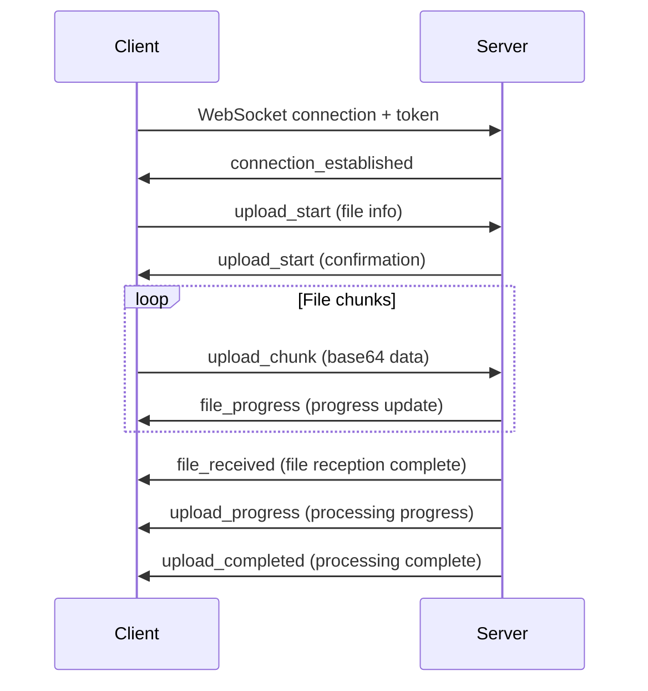

## 概览

该模块提供完整的健康文件处理能力，包括文件上传、健康指标提取与文件删除。系统采用模块化设计，支持多种文件类型，并提供实时进度反馈。

## 特性

- ✅ **多种上传方式**：WebSocket 实时上传与 REST API 批量上传
- ✅ **实时进度反馈**：WebSocket 连接会实时推送进度更新
- ✅ **智能文件识别**：自动识别文件类型并选择合适的 handler
- ✅ **健康指标提取**：使用 LLM 自动提取健康指标数据
- ✅ **多格式支持**：PDF、图片、音频、基因数据等
- ✅ **PDF 并行处理**：多页 PDF 并行处理以提升效率
- ✅ **文件摘要生成**：自动生成文件内容摘要
- ✅ **级联删除**：删除文件时自动清理关联健康数据

## 支持的文件类型

| 文件类型 | MIME Type | Handler | 说明 |
|-----------|-----------|---------|-------------|
| PDF | `application/pdf` | `PDFHandler` | 多页并行处理，并自动提取健康指标 |
| 图片（Images） | `image/*` | `ImageHandler` | 支持 JPEG/PNG/GIF/WebP；识别健康报告并提取指标 |
| 音频（Audio） | `audio/*` | `AudioHandler` | 语音转文字，用于提取口述健康信息 |
| 基因数据（Genetic Data） | 特定格式（Specific formats） | `GeneticHandler` | 基因检测报告解析 |

## 文件上传方式

### WebSocket 上传（推荐）

WebSocket 上传提供实时进度反馈，适用于大文件上传以及需要实时状态更新的场景。

#### 接口（Endpoint）

```
ws://<host>/ws/upload-health-report?token=<auth_token>
```

#### 连接流程（Connection Flow）



#### 消息类型（Message Types）

##### 1. 上传开始（Upload Start，upload_start）

客户端发送：
```json
{
    "type": "upload_start",
    "messageId": "unique-message-id",
    "sessionId": "session-id",
    "query": "user notes",
    "isFirstMessage": false,
    "query_user_id": "target-user-id",
    "files": [
        {
            "filename": "report.pdf",
            "contentType": "application/pdf",
            "size": 1024000
        }
    ]
}
```

| 字段 | 类型（Type） | 必填（Required） | 说明 |
|-------|------|----------|-------------|
| type | string | ✅ | 必须为 `"upload_start"` |
| messageId | string | ❌ | 唯一消息 ID；未提供时会自动生成 |
| sessionId | string | ✅ | 会话 ID（Session ID） |
| query | string | ❌ | 用户备注或 query 文本 |
| isFirstMessage | boolean | ❌ | 是否为该 session 的第一条消息 |
| query_user_id | string | ❌ | 代理上传（proxy uploads）的目标 user ID |
| files | array | ✅ | 文件元数据数组 |

服务端响应：
```json
{
    "type": "upload_start",
    "messageId": "generated-message-id",
    "sessionId": "session-id",
    "status": "uploading",
    "progress": 0,
    "message": "Ready to receive 1 files",
    "files": [...]
}
```

##### 2. 上传分片（Upload Chunk，upload_chunk）

客户端发送：
```json
{
    "type": "upload_chunk",
    "messageId": "message-id",
    "filename": "report.pdf",
    "chunk": "<base64-encoded-data>",
    "chunkIndex": 0,
    "totalChunks": 10,
    "contentType": "application/pdf",
    "fileSize": 1024000
}
```

服务端响应：
```json
{
    "type": "file_progress",
    "messageId": "message-id",
    "filename": "report.pdf",
    "progress": 10.0,
    "status": "uploading",
    "message": "Uploading report.pdf: 10.0%"
}
```

##### 3. 文件接收完成（File Received，file_received）

```json
{
    "type": "file_received",
    "messageId": "message-id",
    "filename": "report.pdf",
    "status": "received",
    "message": "File report.pdf received successfully",
    "size": 1024000
}
```

##### 4. 处理进度（Upload Progress，upload_progress）

```json
{
    "type": "upload_progress",
    "messageId": "message-id",
    "status": "processing",
    "progress": 65,
    "message": "Starting to analyze health indicators in report.pdf...",
    "filename": "report.pdf",
    "timestamp": "2024-01-15T10:30:00.000Z"
}
```

##### 5. 处理完成（Upload Completed，upload_completed）

```json
{
    "type": "upload_completed",
    "messageId": "message-id",
    "status": "completed",
    "progress": 100,
    "message": "Processing completed: 1 files successful",
    "successful_files": 1,
    "failed_files": 0,
    "total_files": 1,
    "results": {
        "success": true,
        "message": "File processing completed",
        "type": "pdf",
        "url_thumb": ["https://..."],
        "url_full": ["https://..."],
        "files": [
            {
                "filename": "report.pdf",
                "type": "pdf",
                "url_thumb": "https://...",
                "url_full": "https://...",
                "file_key": "uploads/xxx.pdf",
                "file_size": 1024000,
                "file_abstract": "Health report summary...",
                "file_name": "2024 Annual Health Report",
                "success": true
            }
        ]
    }
}
```

##### 6. 心跳（Heartbeat，ping/pong）

客户端发送：
```json
{
    "type": "ping"
}
```

服务端响应：
```json
{
    "type": "pong",
    "timestamp": "2024-01-15T10:30:00.000Z"
}
```

#### 超时机制（Timeout Mechanism）

| 类型 | 时长 | 说明 |
|------|----------|-------------|
| 空闲超时（Idle Timeout） | 5 minutes | 无活动时自动断开 |
| 上传超时（Upload Timeout） | 30 minutes | 上传过程中延长超时时间 |
| 心跳（Heartbeat） | 30 seconds | 建议的 ping 间隔 |

### REST API 上传

REST API 提供更简单的上传方式，适用于简单场景或不需要实时进度的应用。

#### 接口（Endpoint）

```http
POST /files/upload
Content-Type: multipart/form-data
Authorization: Bearer <token>
```

#### 请求参数

| 参数 | Type | Required | 说明 |
|-----------|------|----------|-------------|
| files | File[] | ✅ | 要上传的文件列表 |
| folder | string | ❌ | 自定义 folder 前缀，默认 `uploads` |

#### 响应示例（Response Example）

```json
{
    "code": 0,
    "msg": "All 2 files uploaded successfully",
    "data": [
        {
            "file_url": "https://storage.example.com/uploads/20240115_xxx.pdf",
            "file_name": "report.pdf",
            "file_key": "uploads/20240115_xxx.pdf",
            "file_size": 1024000,
            "file_type": "application/pdf",
            "upload_time": "2024-01-15T10:30:00.000Z",
            "duration": null
        }
    ]
}
```

#### 响应码

| Code | 说明 |
|------|-------------|
| 0 | 上传全部成功 |
| 1 | 部分或全部失败 |

## 处理架构（Processing Architecture）

### 概览

```
┌───────────────────────────────────────────────────────────────┐
│                         File Upload                           │
│  ┌─────────────┐    ┌─────────────┐    ┌─────────────┐        │
│  │  WebSocket  │    │  REST API   │    │   Direct    │        │
│  │   Upload    │    │   Upload    │    │   Upload    │        │
│  └──────┬──────┘    └──────┬──────┘    └──────┬──────┘        │
│         │                  │                  │                │
│         └──────────────────┼──────────────────┘                │
│                            ▼                                   │
│                   ┌─────────────────┐                          │
│                   │  FileProcessor  │                          │
│                   └────────┬────────┘                          │
│                            │                                   │
│         ┌──────────────────┼──────────────────┐                │
│         ▼                  ▼                  ▼                │
│  ┌─────────────┐   ┌─────────────┐   ┌─────────────┐          │
│  │ PDFHandler  │   │ImageHandler │   │AudioHandler │   ...    │
│  └──────┬──────┘   └──────┬──────┘   └──────┬──────┘          │
│         │                  │                  │                │
│         └──────────────────┼──────────────────┘                │
│                            ▼                                   │
│                  ┌───────────────────┐                         │
│                  │IndicatorExtractor │                         │
│                  └─────────┬─────────┘                         │
│                            ▼                                   │
│                   ┌─────────────────┐                          │
│                   │    Database     │                          │
│                   │  (th_messages,  │                          │
│                   │  th_series_data)│                          │
│                   └─────────────────┘                          │
└───────────────────────────────────────────────────────────────┘
```

### 处理步骤

#### 1. 文件上传阶段（0–30%）

- 接收文件数据
- 校验文件类型与大小
- 生成唯一文件标识
- 上传到对象存储（S3/OSS/MinIO）

#### 2. 文件类型识别（30–35%）

系统通过 `FileHandlerFactory` 自动识别文件类型：

```python
# Handler selection priority
1. GeneticHandler  - Genetic data files
2. ImageHandler    - Image files (image/*)
3. PDFHandler      - PDF documents
4. AudioHandler    - Audio files (audio/*)
```

#### 3. 内容处理阶段（35–90%）

**PDF 文件处理：**
```
单页/少页 PDF：
  35-65%: File upload and save
  65-90%: LLM indicator extraction

多页 PDF（>2 页）：
  35-50%: File upload and PDF splitting
  50-70%: Parallel page processing
  70-90%: Result merging and deduplication
```

**图片文件处理：**
```
35-55%: Image upload
55-90%: Recognition + indicator extraction
```

#### 4. 摘要生成阶段（90–95%）

- 使用 LLM 生成文件内容摘要
- 生成智能文件名

#### 5. 结果保存阶段（95–100%）

- 将处理结果保存到数据库
- 将健康指标同步到 `th_series_data`
- 更新用户健康 profile

## 健康指标提取（Health Indicator Extraction）

### 配置

```yaml config.yaml
ENABLE_INDICATOR_EXTRACTION: 1  # Set to 1 to enable indicator extraction
```

### 支持的指标类型

- Complete Blood Count（WBC、RBC、Hemoglobin 等）
- Biochemistry（Liver function、Kidney function、Lipids 等）
- Physical Examination（Blood pressure、Heart rate、Weight 等）
- Tumor Markers（肿瘤标志物）
- Thyroid Function（甲状腺功能）
- 其他医学检测指标

### 提取结果格式

```json
{
    "indicators": [
        {
            "original_indicator": "White Blood Cell Count",
            "value": "6.5",
            "unit": "10^9/L",
            "reference_range": "4.0-10.0",
            "status": "normal"
        },
        {
            "original_indicator": "Hemoglobin",
            "value": "145",
            "unit": "g/L",
            "reference_range": "120-160",
            "status": "normal"
        }
    ],
    "content_info": {
        "date_time": "2024-01-15",
        "institution": "XX Hospital"
    },
    "file_abstract": "January 2024 health report including CBC, comprehensive metabolic panel..."
}
```

### 数据存储

提取出的指标数据会存储在 `th_series_data` 表中：

| 字段 | 说明 |
|-------|-------------|
| user_id | 用户 ID |
| indicator_id | 指标 ID（关联指标维表） |
| value | 指标值 |
| unit | 计量单位 |
| source_table | 来源表名 |
| source_table_id | 来源记录 ID（message_id + file_key） |
| recorded_at | 检测日期/时间 |

## 文件删除（File Deletion）

### 接口（Endpoint）

```http
POST /api/v1/data/delete-files
Content-Type: application/json
Authorization: Bearer <token>
```

### 请求体（Request Body）

```json
{
    "message_id": "message-uuid",
    "file_keys": ["uploads/xxx.pdf", "uploads/yyy.jpg"]
}
```

| 参数 | Type | Required | 说明 |
|-----------|------|----------|-------------|
| message_id | string | ✅ | Message ID |
| file_keys | string[] | ❌ | 要删除的 file keys；为空则删除该消息下所有文件 |

### 响应示例（Response Example）

```json
{
    "code": 0,
    "msg": "Successfully deleted 2 file(s)",
    "data": {
        "success": true,
        "message_id": "message-uuid",
        "deleted_files": [
            {
                "file_key": "uploads/xxx.pdf",
                "filename": "report.pdf",
                "type": "pdf",
                "status": "deleted"
            }
        ],
        "failed_deletions": [],
        "remaining_files_count": 0,
        "message_deleted": true
    }
}
```

### 级联删除（Cascade Deletion）

删除文件时，系统会自动执行级联删除：

1. **Storage Deletion**：从对象存储（S3/OSS）删除文件
2. **Database Update**：更新 `th_messages` 表中的文件列表
3. **Health Data Cleanup**：从 `th_series_data` 删除关联的健康指标
4. **Genetic Data Cleanup**：如果是基因文件，则从 `th_genetic_data` 删除关联数据
5. **Message Marking**：如果所有文件都已删除，则将该消息标记为已删除

## API 参考

### 文件服务 Endpoints

| 方法 | Endpoint | 说明 |
|--------|----------|-------------|
| WS | `/ws/upload-health-report` | WebSocket 文件上传 |
| POST | `/files/upload` | REST API 文件上传 |
| POST | `/api/v1/data/delete-files` | 删除文件 |
| GET | `/files/{file_path}` | 获取文件内容（proxy access） |

### 认证（Authentication）

所有 endpoints 都需要有效的 authentication token：

- **REST API**：使用 `Authorization: Bearer <token>` header
- **WebSocket**：通过 URL 参数 `?token=<token>` 传入

## 数据模型（Data Models）

### FileUploadData

```typescript
interface FileUploadData {
    file_url: string;      // File access URL
    file_name: string;     // Original filename
    file_key: string;      // Storage key
    file_size: number;     // File size in bytes
    file_type: string;     // MIME type
    upload_time: string;   // Upload timestamp
    duration?: number;     // Audio duration in ms (audio files only)
}
```

### FileDeleteRequest

```typescript
interface FileDeleteRequest {
    message_id: string;        // Message ID
    file_keys?: string[];      // List of file keys to delete
}
```

### FileProcessingResult

```typescript
interface FileProcessingResult {
    success: boolean;
    message: string;
    type: string;              // File type: pdf, image, audio, etc.
    filename: string;          // Original filename
    full_url: string;          // Full access URL
    file_key: string;          // Storage key
    file_abstract: string;     // File summary
    file_name: string;         // AI-generated file name
    raw?: string;              // Formatted markdown content from extracted data
}
```

## 错误处理（Error Handling）

### WebSocket 错误消息

```json
{
    "type": "upload_error",
    "messageId": "message-id",
    "status": "failed",
    "message": "Upload start failed: <error_details>"
}
```

### REST API 错误响应

```json
{
    "code": 1,
    "msg": "File upload failed: <error_details>",
    "data": null
}
```

### 常见错误

| 错误类型 | 说明 | 处理建议 |
|------------|-------------|----------|
| Invalid token | Token 无效或已过期 | 获取新的 token |
| File type not supported | 不支持的文件类型 | 使用受支持的文件格式 |
| File is empty | 文件内容为空 | 检查文件内容 |
| Upload session not found | 上传 session 不存在 | 重新开始上传 |
| Permission denied | 无操作权限 | 检查用户权限 |

### 超时处理

WebSocket 连接超时时会收到通知：

```json
{
    "type": "connection_timeout",
    "message": "Connection closed due to 5 minutes of inactivity",
    "idle_seconds": 300,
    "timeout_type": "idle",
    "active_uploads_count": 0
}
```

## 最佳实践

### 大文件上传

- 使用 WebSocket 分块（chunked）上传
- 建议 chunk size：1MB
- 实现可续传上传机制

### 批量上传

- 单次上传建议不超过 10 个文件
- 总文件大小建议不超过 100MB

### 进度监控

- WebSocket 上传期间监听 `upload_progress` 消息
- 处理 `file_progress` 以展示单文件进度

### 错误处理

- 实现重试机制（建议最多 3 次重试）
- 捕获并展示对用户友好的错误信息

### 连接保活（Keep-alive）

- WebSocket 连接每 30 秒发送一次 ping
- 处理 pong 响应以确认连接状态

## 代码示例

### Python REST API Upload

```python
import requests
from pathlib import Path

def upload_files(file_paths: list, token: str, folder: str = None) -> dict:
    """Upload files to the server."""
    url = "http://localhost:18080/files/upload"
    headers = {"Authorization": f"Bearer {token}"}
    
    files = []
    for file_path in file_paths:
        path = Path(file_path)
        files.append(('files', (path.name, open(path, 'rb'))))
    
    params = {}
    if folder:
        params['folder'] = folder
    
    try:
        response = requests.post(url, headers=headers, files=files, params=params)
        return response.json()
    finally:
        for _, file_tuple in files:
            file_tuple[1].close()

# Usage
result = upload_files(
    file_paths=["./report.pdf", "./lab_results.jpg"],
    token="your-auth-token",
    folder="health-reports"
)
```

### File Deletion

```python
def delete_files(message_id: str, file_keys: list, token: str) -> dict:
    """Delete files from a message."""
    url = "http://localhost:18080/api/v1/data/delete-files"
    headers = {
        "Authorization": f"Bearer {token}",
        "Content-Type": "application/json"
    }
    
    payload = {
        "message_id": message_id,
        "file_keys": file_keys
    }
    
    response = requests.post(url, headers=headers, json=payload)
    return response.json()
```

## 下一步

<CardGroup cols={2}>
  <Card title="API Reference" icon="book" href="/zh/api-reference/introduction">
    浏览完整 API 文档
  </Card>
  <Card title="Configuration" icon="gear" href="/zh/configuration">
    配置文件处理相关设置
  </Card>
  <Card title="Testing" icon="flask" href="/zh/development/testing">
    测试文件上传与处理
  </Card>
  <Card title="Architecture" icon="diagram-project" href="/zh/concepts/architecture">
    了解系统架构
  </Card>
</CardGroup>


