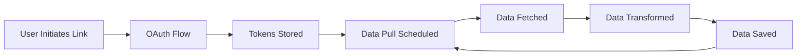

## 概览

本指南介绍如何为新的健康设备或平台构建自定义 Provider 集成。Provider 系统的设计目标是在保证安全与数据质量的前提下，让新增集成尽可能简单直观。

<Info>
如果你只是想**使用**现有 Providers（如 Garmin、Whoop），请参见[使用 Providers](/zh/providers/using-providers)。
</Info>

## 前置条件

在集成新的 Provider 之前，请确保你具备：

<AccordionGroup>
  <Accordion title="技术要求" icon="code">
    - Python 3.12+ 环境
    - 可访问目标设备/服务的 API 文档
    - 设备厂商提供的 OAuth 凭据（OAuth 1.0 或 OAuth 2.0）
    - 熟悉 Python 的 async/await 模式
    - 熟悉 REST APIs 与 JSON 数据格式
  </Accordion>

  <Accordion title="OAuth 凭据" icon="key">
    从健康设备厂商获取 OAuth 凭据：
    - **Client ID** / Consumer Key
    - **Client Secret** / Consumer Secret
    - 用于认证与数据访问的 **API endpoints**
    - 访问健康数据所需的 **OAuth scopes**
  </Accordion>

  <Accordion title="数据库准备" icon="database">
    你的 Provider 需要一个专用表来存储 raw 数据：

    ```sql
    CREATE TABLE IF NOT EXISTS theta_ai.health_data_<provider> (
        id SERIAL PRIMARY KEY,
        create_at TIMESTAMP DEFAULT CURRENT_TIMESTAMP,
        update_at TIMESTAMP DEFAULT CURRENT_TIMESTAMP,
        is_del BOOLEAN DEFAULT FALSE,
        msg_id VARCHAR(255) UNIQUE NOT NULL,
        raw_data JSONB NOT NULL,
        theta_user_id VARCHAR(255) NOT NULL,
        external_user_id VARCHAR(255)
    );
    
    CREATE INDEX idx_health_data_<provider>_theta_user_id 
        ON theta_ai.health_data_<provider>(theta_user_id);
    CREATE INDEX idx_health_data_<provider>_msg_id 
        ON theta_ai.health_data_<provider>(msg_id);
    ```
  </Accordion>
</AccordionGroup>

## Provider Architecture

### Directory Structure

```
connect/
├── __init__.py
└── theta/
    └── mirobody_<provider>/
        ├── __init__.py
        └── provider_<provider>.py
```

### Class Hierarchy

```
BaseThetaProvider (from mirobody.pulse.theta.platform.base)
    ↓
ThetaYourProvider (your implementation)
```

完整实现细节请参见仓库中的 [Provider Integration Guide](https://github.com/thetahealth/mirobody-health/blob/main/connect/PROVIDER_INTEGRATION_GUIDE.md)。

## Quick Start

<Steps>
  <Step title="创建 Provider 模块">
    为你的 Provider 创建一个新目录：

    ```bash
    mkdir -p connect/theta/mirobody_yourprovider
    touch connect/theta/mirobody_yourprovider/__init__.py
    touch connect/theta/mirobody_yourprovider/provider_yourprovider.py
    ```
  </Step>

  <Step title="实现 Provider class">
    创建继承自 `BaseThetaProvider` 的 Provider class：

    ```python provider_yourprovider.py
    from mirobody.pulse.theta.platform.base import BaseThetaProvider
    from mirobody.pulse.theta.platform.indicator import StandardIndicator
    
    class ThetaYourProvider(BaseThetaProvider):
        """Your health device provider"""
        
        @classmethod
        def factory(cls, **configs):
            """Factory method for provider instantiation"""
            return cls()
        
        @classmethod
        def info(cls) -> ProviderInfo:
            """Provider metadata"""
            return ProviderInfo(
                slug="theta_yourprovider",
                name="Your Provider",
                description="Integration with Your Health Device"
            )
        
        # Implement required methods...
    ```
  </Step>

  <Step title="配置 OAuth">
    在 `config.yaml` 中添加配置：

    ```yaml
    YOURPROVIDER_CLIENT_ID: 'your_client_id'
    YOURPROVIDER_CLIENT_SECRET: 'your_client_secret'
    YOURPROVIDER_REDIRECT_URL: 'http://localhost:18080/api/v1/pulse/theta/theta_yourprovider/callback'
    ```
  </Step>

  <Step title="测试 Provider">
    测试 OAuth flow 与数据拉取：

    ```bash
    # Start the application
    docker-compose up -d
    
    # Test OAuth link
    curl "http://localhost:18080/api/v1/pulse/theta/theta_yourprovider/link?user_id=test_user"
    ```
  </Step>
</Steps>

## Implementation Checklist

<AccordionGroup>
  <Accordion title="Required Methods" icon="list-check">
    你的 Provider 必须实现：

    - ✅ `factory()` - Provider instantiation
    - ✅ `info()` - Provider metadata
    - ✅ `link()` - Initiate OAuth flow
    - ✅ `callback()` - Handle OAuth callback
    - ✅ `unlink()` - Disconnect provider
    - ✅ `pull_from_vendor_api()` - Fetch data from API
    - ✅ `format_data()` - Transform to standard format
    - ✅ `save_raw_data_to_db()` - Persist raw data
    - ✅ `is_data_already_processed()` - Check for duplicates
  </Accordion>

  <Accordion title="OAuth Implementation" icon="key">
    根据 Provider 的要求选择 OAuth 版本：

    **OAuth 1.0** (e.g., Garmin):
    - Request token
    - User authorization
    - Access token exchange

    **OAuth 2.0** (e.g., Whoop):
    - Authorization code
    - Token exchange
    - Token refresh handling

    详细示例请参见 [OAuth Implementation](/zh/development/oauth-implementation)。
  </Accordion>

  <Accordion title="Data Mapping" icon="arrows-rotate">
    将 vendor 特定数据映射到标准指标：

    ```python
    PROVIDER_INDICATOR_MAPPING = {
        "daily_steps": StandardIndicator.DAILY_STEPS,
        "sleep_time": StandardIndicator.DAILY_SLEEP_DURATION,
        "heart_rate": StandardIndicator.HEART_RATE,
    }
    ```

    转换模式请参见 [Data Mapping](/zh/development/data-mapping)。
  </Accordion>

  <Accordion title="Testing" icon="flask">
    充分测试你的 Provider：

    - Unit tests for each method
    - OAuth flow integration tests
    - Data transformation tests
    - Error handling tests

    指南请参见 [Provider Testing](/zh/development/provider-testing)。
  </Accordion>
</AccordionGroup>

## Key Concepts

### Provider Lifecycle



### Data Flow

1. **Raw Data Fetch**：从 vendor API 拉取数据
2. **Raw Data Storage**：保存到 provider 专用表
3. **Transformation**：转换为标准指标
4. **Standard Storage**：写入 `th_series_data` 表
5. **Deduplication**：跳过已处理记录

## Configuration

在 `config.yaml` 中添加 Provider 配置：

```yaml config.yaml
# OAuth Settings
YOURPROVIDER_CLIENT_ID: 'your_client_id'
YOURPROVIDER_CLIENT_SECRET: 'your_client_secret'
YOURPROVIDER_REDIRECT_URL: 'http://localhost:18080/api/v1/pulse/theta/theta_yourprovider/callback'

# Optional: API Endpoints
YOURPROVIDER_AUTH_URL: 'https://auth.yourprovider.com'
YOURPROVIDER_TOKEN_URL: 'https://api.yourprovider.com/token'
YOURPROVIDER_API_BASE_URL: 'https://api.yourprovider.com/v1'

# Optional: OAuth Scopes
YOURPROVIDER_SCOPES: 'read:health read:profile'

# Optional: Performance
YOURPROVIDER_REQUEST_TIMEOUT: 30
YOURPROVIDER_CONCURRENT_REQUESTS: 5
```

## Example: Minimal Provider

Here's a minimal provider implementation:

```python
from mirobody.pulse.theta.platform.base import BaseThetaProvider, ProviderInfo
from mirobody.pulse.theta.platform.indicator import StandardIndicator
from typing import Dict, List

class ThetaSimpleProvider(BaseThetaProvider):
    """Simple example provider"""
    
    @classmethod
    def factory(cls, **configs):
        return cls()
    
    @classmethod
    def info(cls) -> ProviderInfo:
        return ProviderInfo(
            slug="theta_simple",
            name="Simple Provider",
            description="Example provider integration"
        )
    
    async def link(self, user_id: str, return_url: str = None) -> Dict:
        """Initiate OAuth flow"""
        # Generate OAuth URL
        auth_url = self._build_auth_url(user_id)
        return {"link_web_url": auth_url}
    
    async def callback(self, user_id: str, **params) -> Dict:
        """Handle OAuth callback"""
        # Exchange code for tokens
        tokens = await self._exchange_token(params.get("code"))
        # Store tokens securely
        await self._store_tokens(user_id, tokens)
        return {"success": True}
    
    async def unlink(self, user_id: str) -> Dict:
        """Disconnect provider"""
        await self._delete_tokens(user_id)
        return {"success": True}
    
    async def pull_from_vendor_api(self, user_id: str) -> List[Dict]:
        """Fetch data from provider API"""
        tokens = await self._get_tokens(user_id)
        # Call vendor API
        data = await self._api_call("/user/health", tokens)
        return data
    
    def format_data(self, raw_data: Dict) -> List[StandardPulseData]:
        """Transform to standard format"""
        return [
            StandardPulseData(
                indicator=StandardIndicator.DAILY_STEPS,
                value=str(raw_data["steps"]),
                start_time=raw_data["date"],
                end_time=raw_data["date"]
            )
        ]
```

<Tip>
See [Garmin Provider Example](/zh/examples/garmin-provider) and [Whoop Provider Example](/zh/examples/whoop-provider) for complete implementations.
</Tip>

## Detailed Documentation

For comprehensive implementation details, refer to these guides:

<CardGroup cols={2}>
  <Card title="OAuth Implementation" icon="key" href="/zh/development/oauth-implementation">
    Implement OAuth 1.0 or 2.0 flows
  </Card>
  <Card title="Data Mapping" icon="arrows-rotate" href="/zh/development/data-mapping">
    Transform vendor data to standard format
  </Card>
  <Card title="Provider Testing" icon="flask" href="/zh/development/provider-testing">
    Test your provider integration
  </Card>
  <Card title="Full Integration Guide" icon="book" href="https://github.com/thetahealth/mirobody-health/blob/main/connect/PROVIDER_INTEGRATION_GUIDE.md">
    Complete guide in repository
  </Card>
</CardGroup>

## Standard Health Indicators

Map your provider's data to these standard indicators:

| Indicator | Description | Unit |
|-----------|-------------|------|
| `DAILY_STEPS` | Daily step count | steps |
| `DAILY_SLEEP_DURATION` | Total sleep time | milliseconds |
| `HEART_RATE` | Heart rate measurement | bpm |
| `DAILY_HEART_RATE_RESTING` | Resting heart rate | bpm |
| `HRV` | Heart rate variability | ms |
| `WEIGHT` | Body weight | grams |
| `DAILY_CALORIES_ACTIVE` | Active calories burned | kcal |
| `SLEEP_EFFICIENCY` | Sleep efficiency | percentage |

See [Standard Indicators](/zh/providers/overview#standard-health-indicators) for the complete list.

## Contributing Your Provider

Once you've built a provider, consider contributing it back:

<Steps>
  <Step title="Test thoroughly">
    Ensure all OAuth flows work and data transforms correctly
  </Step>

  <Step title="Document your provider">
    Add configuration instructions and supported metrics
  </Step>

  <Step title="Submit pull request">
    Follow the [Contributing Guide](/zh/development/contributing)
  </Step>
</Steps>

<Note>
See the [complete Provider Integration Guide](https://github.com/thetahealth/mirobody-health/blob/main/connect/PROVIDER_INTEGRATION_GUIDE.md) in the repository for detailed implementation instructions, including all required methods, OAuth patterns, data transformation examples, and best practices.
</Note>

## Next Steps

<CardGroup cols={2}>
  <Card title="OAuth Implementation" icon="key" href="/zh/development/oauth-implementation">
    Learn OAuth 1.0 and 2.0 flows
  </Card>
  <Card title="Data Mapping" icon="arrows-rotate" href="/zh/development/data-mapping">
    Transform vendor data
  </Card>
  <Card title="Provider Testing" icon="flask" href="/zh/development/provider-testing">
    Test your integration
  </Card>
  <Card title="Examples" icon="code" href="/zh/examples/garmin-provider">
    See real provider code
  </Card>
</CardGroup>
