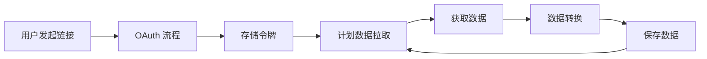

## 概览

本指南介绍如何为新的健康设备或平台构建自定义提供商 (Provider) 集成。提供商系统的设计目标是在保持安全性和数据质量的同时，让新增集成变得简单直接。

<Info>
如果您是想**使用**现有的提供商（如 Garmin 或 Whoop），请参阅[使用提供商](/zh/providers/using-providers)。
</Info>

## 前置条件

在集成新的提供商之前，请确保您具备以下条件：

<AccordionGroup>
  <Accordion title="技术要求" icon="code">
    - Python 3.12+ 环境
    - 访问目标设备/服务 API 文档的权限
    - 获得设备厂商提供的 OAuth 凭据 (OAuth 1.0 或 OAuth 2.0)
    - 熟悉 Python 的 async/await 异步模式
    - 熟悉 REST API 和 JSON 数据格式
  </Accordion>

  <Accordion title="OAuth 凭据" icon="key">
    从健康设备厂商获取 OAuth 凭据：
    - **Client ID** / Consumer Key
    - **Client Secret** / Consumer Secret
    - 用于身份验证和数据访问的 **API 端点 (Endpoints)**
    - 访问健康数据所需的 **OAuth 权限范围 (Scopes)**
  </Accordion>

  <Accordion title="数据库设置" icon="database">
    您的提供商需要一个专用的表来存储原始数据：

    ```sql
    CREATE TABLE IF NOT EXISTS theta_ai.health_data_<provider> (
        id SERIAL PRIMARY KEY,
        create_at TIMESTAMP DEFAULT CURRENT_TIMESTAMP,
        update_at TIMESTAMP DEFAULT CURRENT_TIMESTAMP,
        is_del BOOLEAN DEFAULT FALSE,
        msg_id VARCHAR(255) UNIQUE NOT NULL,
        raw_data JSONB NOT NULL,
        theta_user_id VARCHAR(255) NOT NULL,
        external_user_id VARCHAR(255)
    );
    
    CREATE INDEX idx_health_data_<provider>_theta_user_id 
        ON theta_ai.health_data_<provider>(theta_user_id);
    CREATE INDEX idx_health_data_<provider>_msg_id 
        ON theta_ai.health_data_<provider>(msg_id);
    ```
  </Accordion>
</AccordionGroup>

## 提供商架构

### 目录结构

```
mirobody/pulse/theta/
├── __init__.py
├── mirobody_<provider>/
│   ├── __init__.py
│   ├── provider_<provider>.py
│   └── README.md (可选)
└── platform/
    ├── __init__.py
    ├── base.py              # BaseThetaProvider
    ├── database_service.py  # 数据库操作
    ├── platform.py          # 平台管理
    ├── pull_task.py         # 计划的数据拉取任务
    └── utils.py             # 工具函数
```

### 类层次结构

```
BaseThetaProvider (来自 mirobody.pulse.theta.platform.base)
    ↓
ThetaYourProvider (您的实现)
```

### 现有示例

参考以下提供商实现：
- **Garmin Connect**: `mirobody/pulse/theta/mirobody_garmin_connect/`
- **Whoop**: `mirobody/pulse/theta/mirobody_whoop/`

如需完整的实现细节，请参阅仓库中的 [提供商集成指南](https://github.com/thetahealth/mirobody-health/blob/main/mirobody/pulse/README.md)。

## 快速上手

<Steps>
  <Step title="创建提供商模块">
    为您的提供商创建一个新目录：

    ```bash
    mkdir -p mirobody/pulse/theta/mirobody_yourprovider
    touch mirobody/pulse/theta/mirobody_yourprovider/__init__.py
    touch mirobody/pulse/theta/mirobody_yourprovider/provider_yourprovider.py
    ```
  </Step>

  <Step title="实现提供商类">
    创建继承自 `BaseThetaProvider` 的提供商类：

    ```python provider_yourprovider.py
    from mirobody.pulse.theta.platform.base import BaseThetaProvider
    from mirobody.pulse.theta.platform.indicator import StandardIndicator
    
    class ThetaYourProvider(BaseThetaProvider):
        """您的健康设备提供商"""
        
        @classmethod
        def factory(cls, **configs):
            """提供商实例化的工厂方法"""
            return cls()
        
        @classmethod
        def info(cls) -> ProviderInfo:
            """提供商元数据"""
            return ProviderInfo(
                slug="theta_yourprovider",
                name="您的提供商名称",
                description="与您的健康设备的集成"
            )
        
        # 实现必需的方法...
    ```
  </Step>

  <Step title="配置 OAuth">
    在您的配置文件中添加配置 (例如 `config.localdb.yaml`):

    ```yaml config.localdb.yaml
    # 提供商 OAuth 凭据
    YOURPROVIDER_CLIENT_ID: '您的_client_id'
    YOURPROVIDER_CLIENT_SECRET: '您的_client_secret'
    YOURPROVIDER_REDIRECT_URI: 'http://localhost:18080/api/v1/pulse/theta/theta_yourprovider/callback'
    
    # 可选：如果与默认值不同，配置 API 端点
    YOURPROVIDER_AUTH_URL: 'https://...'
    YOURPROVIDER_TOKEN_URL: 'https://...'
    YOURPROVIDER_API_BASE_URL: 'https://...'
    
    # 可选：OAuth 权限范围 (Scopes)
    YOURPROVIDER_SCOPES: 'scope1 scope2'
    ```
  </Step>

  <Step title="测试您的提供商">
    测试 OAuth 流程和数据获取：

    ```bash
    # 启动应用程序
    docker-compose up -d
    
    # 测试 OAuth 链接
    curl "http://localhost:18080/api/v1/pulse/theta/theta_yourprovider/link?user_id=test_user"
    ```
  </Step>
</Steps>

## 实现检查清单

<AccordionGroup>
  <Accordion title="必需方法" icon="list-check">
    您的提供商必须实现：

    - ✅ `factory()` - 提供商实例化
    - ✅ `info()` - 提供商元数据
    - ✅ `link()` - 发起 OAuth 流程
    - ✅ `callback()` - 处理 OAuth 回调
    - ✅ `unlink()` - 断开提供商连接
    - ✅ `pull_from_vendor_api()` - 从 API 获取数据
    - ✅ `format_data()` - 转换为标准格式
    - ✅ `save_raw_data_to_db()` - 持久化原始数据
    - ✅ `is_data_already_processed()` - 检查重复数据
  </Accordion>

  <Accordion title="OAuth 实现" icon="key">
    根据提供商要求选择 OAuth 版本：

    **OAuth 1.0** (如 Garmin):
    - 请求令牌 (Request token)
    - 用户授权
    - 交换访问令牌 (Access token)

    **OAuth 2.0** (如 Whoop):
    - 授权码 (Authorization code)
    - 交换令牌
    - 令牌刷新处理

    有关详细示例，请参阅 [OAuth 实现](/zh/development/oauth-implementation)。
  </Accordion>

  <Accordion title="数据映射" icon="arrows-rotate">
    将厂商特定的数据映射到标准指标：

    ```python
    PROVIDER_INDICATOR_MAPPING = {
        "daily_steps": StandardIndicator.DAILY_STEPS,
        "sleep_time": StandardIndicator.DAILY_SLEEP_DURATION,
        "heart_rate": StandardIndicator.HEART_RATE,
    }
    ```

    有关转换模式，请参阅 [数据映射](/zh/development/data-mapping)。
  </Accordion>

  <Accordion title="测试" icon="flask">
    彻底测试您的提供商：

    - 每个方法的单元测试
    - OAuth 流程集成测试
    - 数据转换测试
    - 错误处理测试

    有关指南，请参阅 [提供商测试](/zh/development/provider-testing)。
  </Accordion>
</AccordionGroup>

## 核心概念

### 提供商生命周期



### 数据流

1. **原始数据获取**: 从厂商 API 拉取数据
2. **原始数据存储**: 保存到提供商特定的表中
3. **转换**: 转换为标准指标
4. **标准存储**: 保存到 `th_series_data` 表
5. **去重**: 跳过已处理的记录

## 配置

在 `config.yaml` 中添加提供商配置：

```yaml config.yaml
# OAuth 设置
YOURPROVIDER_CLIENT_ID: '您的_client_id'
YOURPROVIDER_CLIENT_SECRET: '您的_client_secret'
YOURPROVIDER_REDIRECT_URI: 'http://localhost:18080/api/v1/pulse/theta/theta_yourprovider/callback'

# 可选：API 端点
YOURPROVIDER_AUTH_URL: 'https://auth.yourprovider.com'
YOURPROVIDER_TOKEN_URL: 'https://api.yourprovider.com/token'
YOURPROVIDER_API_BASE_URL: 'https://api.yourprovider.com/v1'

# 可选：OAuth 权限范围
YOURPROVIDER_SCOPES: 'read:health read:profile'

# 可选：性能设置
YOURPROVIDER_REQUEST_TIMEOUT: 30
YOURPROVIDER_CONCURRENT_REQUESTS: 5
```

## 示例：极简提供商

以下是一个极简的提供商实现示例：

```python
from mirobody.pulse.theta.platform.base import BaseThetaProvider, ProviderInfo
from mirobody.pulse.theta.platform.indicator import StandardIndicator
from typing import Dict, List

class ThetaSimpleProvider(BaseThetaProvider):
    """简单示例提供商"""
    
    @classmethod
    def factory(cls, **configs):
        return cls()
    
    @classmethod
    def info(cls) -> ProviderInfo:
        return ProviderInfo(
            slug="theta_simple",
            name="简单提供商",
            description="示例提供商集成"
        )
    
    async def link(self, user_id: str, return_url: str = None) -> Dict:
        """发起 OAuth 流程"""
        # 生成 OAuth URL
        auth_url = self._build_auth_url(user_id)
        return {"link_web_url": auth_url}
    
    async def callback(self, user_id: str, **params) -> Dict:
        """处理 OAuth 回调"""
        # 使用 code 交换令牌
        tokens = await self._exchange_token(params.get("code"))
        # 安全地存储令牌
        await self._store_tokens(user_id, tokens)
        return {"success": True}
    
    async def unlink(self, user_id: str) -> Dict:
        """断开提供商连接"""
        await self._delete_tokens(user_id)
        return {"success": True}
    
    async def pull_from_vendor_api(self, user_id: str) -> List[Dict]:
        """从提供商 API 获取数据"""
        tokens = await self._get_tokens(user_id)
        # 调用厂商 API
        data = await self._api_call("/user/health", tokens)
        return data
    
    def format_data(self, raw_data: Dict) -> List[StandardPulseData]:
        """转换为标准格式"""
        return [
            StandardPulseData(
                indicator=StandardIndicator.DAILY_STEPS,
                value=str(raw_data["steps"]),
                start_time=raw_data["date"],
                end_time=raw_data["date"]
            )
        ]
```

<Tip>
查看 [Garmin 提供商示例](/zh/examples/garmin-provider) 和 [Whoop 提供商示例](/zh/examples/whoop-provider) 以了解完整实现。
</Tip>

## 详细文档

有关全面的实现细节，请参阅以下指南：

<CardGroup cols={2}>
  <Card title="OAuth 实现" icon="key" href="/zh/development/oauth-implementation">
    实现 OAuth 1.0 或 2.0 流程
  </Card>
  <Card title="数据映射" icon="arrows-rotate" href="/zh/development/data-mapping">
    将厂商数据转换为标准格式
  </Card>
  <Card title="提供商测试" icon="flask" href="/zh/development/provider-testing">
    测试您的提供商集成
  </Card>
  <Card title="完整集成指南" icon="book" href="https://github.com/thetahealth/mirobody-health/blob/main/connect/PROVIDER_INTEGRATION_GUIDE.md">
    项目仓库中的完整指南
  </Card>
</CardGroup>

## 标准健康指标

将您的提供商数据映射到这些标准指标：

| 指标 | 描述 | 单位 |
|-----------|-------------|------|
| `DAILY_STEPS` | 每日步数 | steps |
| `DAILY_SLEEP_DURATION` | 总睡眠时间 | 毫秒 (milliseconds) |
| `HEART_RATE` | 心率测量值 | bpm |
| `DAILY_HEART_RATE_RESTING` | 静息心率 | bpm |
| `HRV` | 心率变异性 | 毫秒 (ms) |
| `WEIGHT` | 体重 | 克 (grams) |
| `DAILY_CALORIES_ACTIVE` | 活动卡路里消耗 | kcal |
| `SLEEP_EFFICIENCY` | 睡眠效率 | 百分比 (percentage) |

查看[标准指标](/zh/providers/overview#标准健康指标)获取完整列表。

## 贡献您的提供商集成

一旦您构建了一个提供商，请考虑将其贡献回社区：

<Steps>
  <Step title="彻底测试">
    确保所有 OAuth 流程正常工作且数据转换正确
  </Step>

  <Step title="记录您的提供商">
    添加配置说明和支持的指标
  </Step>

  <Step title="提交 Pull Request">
    遵循[贡献指南](/zh/development/contributing)
  </Step>
</Steps>

<Note>
有关详细的实现说明，包括所有必需的方法、OAuth 模式、数据转换示例和最佳实践，请参阅仓库中完整的[提供商集成指南](https://github.com/thetahealth/mirobody-health/blob/main/connect/PROVIDER_INTEGRATION_GUIDE.md)。
</Note>

## 下一步

<CardGroup cols={2}>
  <Card title="OAuth 实现" icon="key" href="/zh/development/oauth-implementation">
    学习 OAuth 1.0 和 2.0 流程
  </Card>
  <Card title="数据映射" icon="arrows-rotate" href="/zh/development/data-mapping">
    转换厂商数据
  </Card>
  <Card title="提供商测试" icon="flask" href="/zh/development/provider-testing">
    测试您的集成
  </Card>
  <Card title="示例" icon="code" href="/zh/examples/garmin-provider">
    查看真实提供商代码
  </Card>
</CardGroup>
