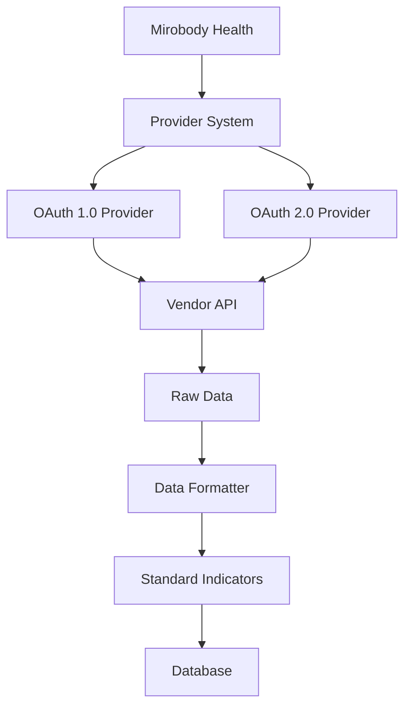

## 什么是 Providers？

Providers 是插件模块，用于将 Mirobody Health 与外部健康/运动设备 API 集成。每个 provider 负责 OAuth 认证、数据拉取，以及将数据转换为统一的标准格式。



## Provider 架构

Mirobody Health 使用可扩展的 provider 架构，便于添加新的健康设备集成：

```
BaseThetaProvider (Abstract Base Class)
    ↓
ThetaGarminProvider (OAuth1 Implementation)
ThetaWhoopProvider (OAuth2 Implementation)
YourCustomProvider (Your Implementation)
```

### Core Components

<CardGroup cols={2}>
  <Card title="Authentication Handler" icon="key">
    管理 OAuth 1.0 / OAuth 2.0 流程，确保用户授权安全
  </Card>
  <Card title="Data Puller" icon="download">
    从 vendor API 拉取健康数据，并处理分页与限流
  </Card>
  <Card title="Data Formatter" icon="arrows-rotate">
    将 vendor 特定的数据转换为标准化健康指标
  </Card>
  <Card title="Database Service" icon="database">
    持久化保存 raw 数据与格式化后的数据，便于审计与追溯
  </Card>
</CardGroup>

## 可用 Providers

### Garmin Connect

<Tabs>
  <Tab title="Overview">
    **Authentication**: OAuth 1.0  
    **Status**: Production Ready  
    **Data Types**: Activities, Sleep, Heart Rate, HRV, Respiration, Stress, Body Composition

    Garmin Connect 是最全面的健康数据来源之一，能从 Garmin 可穿戴设备与运动设备中提供丰富的指标数据。
  </Tab>

  <Tab title="Supported Data">
    | Category | Metrics |
    |----------|---------|
    | **Activity** | Steps, distance, calories (active & basal), floors climbed, active time |
    | **Heart Rate** | Min, max, average, resting, time series samples |
    | **Sleep** | Duration, deep/light/REM sleep, awake time, SpO2, respiration |
    | **HRV** | Time series HRV values |
    | **Respiration** | Respiration rate samples |
    | **Stress** | Stress level measurements |
    | **Body** | Weight, BMI, body fat percentage, skeletal muscle mass |
    | **Workouts** | Exercise sessions with duration, intensity, heart rate |
  </Tab>

  <Tab title="Configuration">
    ```yaml config.yaml
    GARMIN_CLIENT_ID: 'your_consumer_key'
    GARMIN_CLIENT_SECRET: 'your_consumer_secret'
    GARMIN_REDIRECT_URL: 'http://localhost:18080/api/v1/pulse/theta/theta_garmin/callback'
    ```

    详细配置说明请参见[配置指南](/zh/configuration)。
  </Tab>
</Tabs>

### Whoop

<Tabs>
  <Tab title="Overview">
    **Authentication**: OAuth 2.0  
    **Status**: Production Ready  
    **Data Types**: Sleep, Recovery, Cycles, Workouts, Body Measurements

    Whoop 提供面向训练恢复与负荷（strain）的指标，深受运动员与健身爱好者欢迎。
  </Tab>

  <Tab title="Supported Data">
    | Category | Metrics |
    |----------|---------|
    | **Sleep** | Total in bed, awake time, light/slow-wave/REM sleep, sleep efficiency |
    | **Recovery** | HRV, resting heart rate, respiratory rate, SpO2, skin temp |
    | **Cycles** | Strain, kilojoules, average heart rate |
    | **Workouts** | Activity type, duration, intensity, heart rate zones, calories |
    | **Body** | Height, weight, max heart rate |
  </Tab>

  <Tab title="Configuration">
    ```yaml config.yaml
    WHOOP_CLIENT_ID: 'your_client_id'
    WHOOP_CLIENT_SECRET: 'your_client_secret'
    WHOOP_REDIRECT_URL: 'http://localhost:18080/api/v1/pulse/theta/theta_whoop/callback'
    WHOOP_SCOPES: 'offline read:recovery read:sleep read:cycles read:profile read:workout read:body_measurement'
    ```

    详细配置说明请参见[配置指南](/zh/configuration)。
  </Tab>
</Tabs>

## Provider 生命周期

理解 provider 的生命周期，有助于你更高效地使用与排查 providers：

<Steps>
  <Step title="初始化">
    应用启动时，会从 `THETA_PROVIDER_DIRS` 指定的目录中自动发现并初始化 providers。

    ```yaml config.yaml
    THETA_PROVIDER_DIRS:
      - connect/theta
    ```
  </Step>

  <Step title="注册">
    系统会调用每个 provider 的 `create_provider()` class method 来校验配置并创建实例。

    ```python
    @classmethod
    def create_provider(cls, config: Dict[str, Any]) -> Optional['ThetaYourProvider']:
        if not cls._validate_config(config):
            return None
        return cls()
    ```
  </Step>

  <Step title="用户链接">
    当用户发起链接时，provider 的 `link()` method 会生成 OAuth URL。

    ```python
    async def link(self, request: LinkRequest) -> Dict[str, Any]:
        # Generate OAuth authorization URL
        return {"link_web_url": authorization_url}
    ```
  </Step>

  <Step title="认证完成">
    用户授权后，provider 的 `callback()` method 会交换 tokens 并保存凭据。

    ```python
    async def callback(self, code: str, state: str) -> Dict[str, Any]:
        # Exchange code for tokens
        # Save credentials to database
        # Trigger initial data pull
        return {"provider_slug": self.info.slug, "stage": "completed"}
    ```
  </Step>

  <Step title="数据同步">
    周期性或按需触发时，provider 会从 vendor API 拉取数据，保存 raw 数据，进行格式化，并推送到 platform。

    ```python
    async def _pull_and_push_for_user(self, credentials: Dict) -> bool:
        # Pull from vendor API
        # Save raw data
        # Format to standard structure
        # Push to platform
        pass
    ```
  </Step>

  <Step title="取消链接">
    当用户取消链接时，provider 的 `unlink()` method 会撤销访问（可选）并删除已存储的凭据。

    ```python
    async def unlink(self, user_id: str) -> Dict[str, Any]:
        # Revoke access at vendor (optional)
        # Delete credentials from database
        return {"success": True}
    ```
  </Step>
</Steps>

## 标准化健康指标

所有 provider 数据都会被转换为标准化健康指标，以便在不同设备间保持一致：

<AccordionGroup>
  <Accordion title="Activity Indicators" icon="person-running">
    - `DAILY_STEPS`: 步数
    - `DAILY_DISTANCE`: 距离（meters）
    - `DAILY_CALORIES_ACTIVE`: 活动消耗热量（kcal）
    - `DAILY_CALORIES_BASAL`: 基础代谢热量（kcal）
    - `DAILY_FLOORS_CLIMBED`: 爬楼层数（count）
    - `ACTIVE_TIME`: 活动时长（minutes）
  </Accordion>

  <Accordion title="Heart Rate Indicators" icon="heart-pulse">
    - `HEART_RATE`: 瞬时心率（bpm）
    - `DAILY_HEART_RATE_MIN`: 当日最低心率（bpm）
    - `DAILY_HEART_RATE_MAX`: 当日最高心率（bpm）
    - `DAILY_AVG_HEART_RATE`: 当日平均心率（bpm）
    - `DAILY_HEART_RATE_RESTING`: 静息心率（bpm）
    - `HRV`: 心率变异性 RMSSD（ms）
  </Accordion>

  <Accordion title="Sleep Indicators" icon="bed">
    - `DAILY_SLEEP_DURATION`: 总睡眠时长（ms）
    - `SLEEP_IN_BED`: 在床时间（ms）
    - `DAILY_AWAKE_TIME`: 睡眠期间清醒时间（ms）
    - `DAILY_LIGHT_SLEEP`: 浅睡时长（ms）
    - `DAILY_DEEP_SLEEP`: 深睡时长（ms）
    - `DAILY_REM_SLEEP`: REM 睡眠时长（ms）
    - `SLEEP_EFFICIENCY`: 睡眠效率（百分比）
  </Accordion>

  <Accordion title="Body Metrics" icon="weight-scale">
    - `WEIGHT`: 体重（kg）
    - `HEIGHT`: 身高（m）
    - `BMI`: 体重指数
    - `BODY_FAT_PERCENTAGE`: 体脂率
    - `SKELETAL_MUSCLE_MASS`: 骨骼肌量（kg）
  </Accordion>

  <Accordion title="Respiratory Indicators" icon="lungs">
    - `RESPIRATORY_RATE`: 呼吸频率（breaths/min）
    - `BLOOD_OXYGEN`: SpO2（百分比）
  </Accordion>

  <Accordion title="Workout Indicators" icon="dumbbell">
    - `WORKOUT_DURATION_LOW`: 低强度时长（min）
    - `WORKOUT_DURATION_MEDIUM`: 中强度时长（min）
    - `WORKOUT_DURATION_HIGH`: 高强度时长（min）
    - `ALTITUDE_GAIN`: 爬升高度（m）
    - `SPEED`: 平均速度（m/s）
  </Accordion>
</AccordionGroup>

<Info>
完整标准指标列表请参见 mirobody framework 文档中的 `StandardIndicator` enum。
</Info>

## Provider 要求

为确保质量与一致性，所有 providers 必须实现：

<Tabs>
  <Tab title="Required Methods">
    ```python
    class ThetaYourProvider(BaseThetaProvider):
        @classmethod
        def create_provider(cls, config: Dict) -> Optional['ThetaYourProvider']:
            """Factory method for provider instantiation"""
            
        @property
        def info(self) -> ProviderInfo:
            """Provider metadata"""
            
        async def link(self, request: Any) -> Dict[str, Any]:
            """Initiate OAuth flow"""
            
        async def callback(self, *args, **kwargs) -> Dict[str, Any]:
            """Handle OAuth callback"""
            
        async def unlink(self, user_id: str) -> Dict[str, Any]:
            """Unlink user connection"""
            
        async def format_data(self, raw_data: Dict) -> StandardPulseData:
            """Format raw data to standard format"""
            
        async def pull_from_vendor_api(self, *args, **kwargs) -> List[Dict]:
            """Pull data from vendor API"""
            
        async def save_raw_data_to_db(self, raw_data: Dict) -> List[Dict]:
            """Save raw data to database"""
            
        async def is_data_already_processed(self, raw_data: Dict) -> bool:
            """Check if data already processed"""
            
        async def _pull_and_push_for_user(self, credentials: Dict) -> bool:
            """Pull and push data for user"""
    ```
  </Tab>

  <Tab title="Database Schema">
    每个 provider 都需要一个数据库表：

    ```sql
    CREATE TABLE IF NOT EXISTS theta_ai.health_data_<provider> (
        id SERIAL PRIMARY KEY,
        create_at TIMESTAMP DEFAULT CURRENT_TIMESTAMP,
        update_at TIMESTAMP DEFAULT CURRENT_TIMESTAMP,
        is_del BOOLEAN DEFAULT FALSE,
        msg_id VARCHAR(255) UNIQUE NOT NULL,
        raw_data JSONB NOT NULL,
        theta_user_id VARCHAR(255) NOT NULL,
        external_user_id VARCHAR(255)
    );
    
    CREATE INDEX idx_health_data_<provider>_theta_user_id 
        ON theta_ai.health_data_<provider>(theta_user_id);
    CREATE INDEX idx_health_data_<provider>_msg_id 
        ON theta_ai.health_data_<provider>(msg_id);
    ```
  </Tab>

  <Tab title="Configuration">
    `config.yaml` 中所需配置：

    ```yaml
    # OAuth Credentials (required)
    <PROVIDER>_CLIENT_ID: "your_client_id"
    <PROVIDER>_CLIENT_SECRET: "your_client_secret"
    <PROVIDER>_REDIRECT_URL: "your_callback_url"
    
    # OAuth Endpoints (optional, provide defaults in code)
    <PROVIDER>_AUTH_URL: "https://..."
    <PROVIDER>_TOKEN_URL: "https://..."
    <PROVIDER>_API_BASE_URL: "https://..."
    
    # OAuth Scopes (optional)
    <PROVIDER>_SCOPES: "scope1 scope2"
    ```
  </Tab>
</Tabs>

## Provider 发现机制

Mirobody Health 会从配置目录中自动发现并加载 providers：

```python
# In config.yaml
THETA_PROVIDER_DIRS:
  - connect/theta      # Your custom providers
  - providers/theta    # Additional provider directory
```

目录结构示例：

```
connect/theta/
├── mirobody_garmin_connect/
│   ├── __init__.py
│   └── provider_garmin.py
├── mirobody_whoop/
│   ├── __init__.py
│   └── provider_whoop.py
└── mirobody_your_provider/
    ├── __init__.py
    └── provider_your_provider.py
```

<Tip>
为保持一致性，provider 目录名建议遵循 `mirobody_<provider_name>` 的命名规则。
</Tip>

## 最佳实践

<AccordionGroup>
  <Accordion title="错误处理" icon="triangle-exclamation">
    - 外部 API 调用务必使用 try-except
    - 记录带上下文的错误日志（user_id、timestamp、错误细节）
    - 失败时返回空结果，避免崩溃
    - 对瞬时错误实现 exponential backoff
    - 优雅处理 rate limiting
  </Accordion>

  <Accordion title="数据校验" icon="check">
    - 使用前校验 OAuth tokens
    - 转换前检查数据类型
    - 对缺失值/空值做容错处理
    - 校验 timestamp 格式
    - 校验单位是否符合预期
  </Accordion>

  <Accordion title="性能" icon="gauge-high">
    - 所有 I/O 使用 async/await
    - 大数据集实现分页
    - 限制对 vendor API 的并发请求
    - 缓存高频访问的配置
    - 数据库访问使用 connection pooling
  </Accordion>

  <Accordion title="安全" icon="shield-halved">
    - 不要记录敏感数据（tokens、passwords）
    - 在数据库中加密存储凭据
    - 外部通信使用 HTTPS
    - 校验 OAuth state 参数
    - OAuth2 实现 token refresh
  </Accordion>
</AccordionGroup>

## 下一步

<CardGroup cols={2}>
  <Card title="Provider Integration" icon="book" href="/zh/development/provider-integration">
    构建新 provider 的完整指南
  </Card>
  <Card title="OAuth Implementation" icon="key" href="/zh/development/oauth-implementation">
    了解 OAuth 认证流程与实现细节
  </Card>
  <Card title="Data Mapping" icon="table" href="/zh/development/data-mapping">
    学习如何将 vendor 数据映射到标准指标
  </Card>
  <Card title="Provider Testing" icon="flask" href="/zh/development/provider-testing">
    Providers 的测试策略
  </Card>
</CardGroup>
