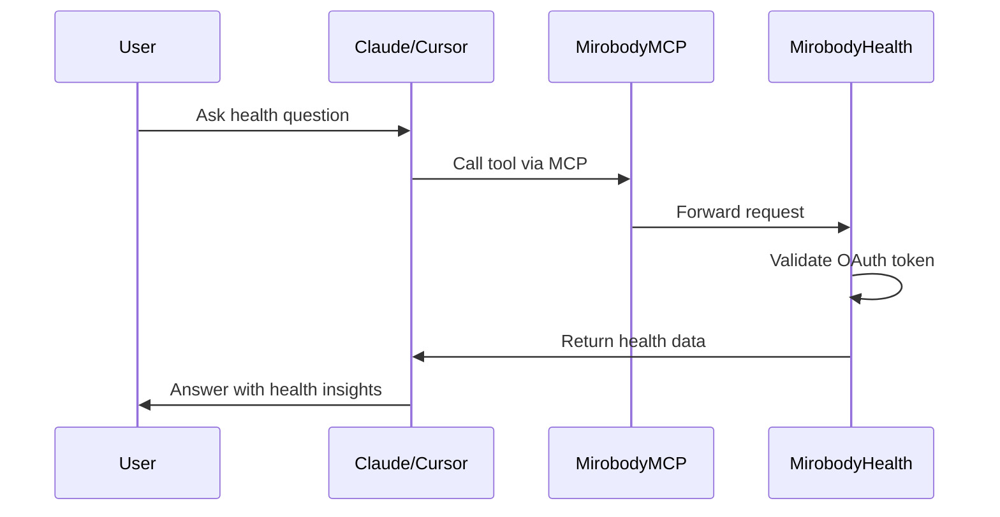

## 概览

Mirobody Health 可作为 **支持 OAuth 的 MCP Server**，把你的所有 Tools 暴露给 Claude Desktop、Cursor 以及自定义 MCP clients 等 AI 客户端。

<Info>
Model Context Protocol（MCP）是 AI 应用访问 Tools、resources 与上下文的标准接口。
</Info>

## MCP 配置

### For Claude Desktop & Cursor

将 Mirobody Health 添加到你的 MCP 配置中：

```json ~/Library/Application Support/Claude/claude_desktop_config.json
{
  "mcpServers": {
    "mirobody_mcp": {
      "command": "npx",
      "args": [
        "-y",
        "universal-mcp-proxy"
      ],
      "env": {
        "UMCP_ENDPOINT": "http://localhost:18080/mcp"
      }
    }
  }
}
```

<Tabs>
  <Tab title="macOS/Linux">
    配置文件位置：
    ```bash
    ~/Library/Application Support/Claude/claude_desktop_config.json
    ```

    对于 Cursor：
    ```bash
    ~/.cursor/mcp_config.json
    ```
  </Tab>

  <Tab title="Windows">
    配置文件位置：
    ```powershell
    %APPDATA%\Claude\claude_desktop_config.json
    ```

    对于 Cursor：
    ```powershell
    %USERPROFILE%\.cursor\mcp_config.json
    ```
  </Tab>
</Tabs>

### 重启客户端

更新配置后：

<Steps>
  <Step title="保存配置文件">
    确保对 MCP 配置文件的修改已保存
  </Step>

  <Step title="重启 Claude/Cursor">
    完全关闭并重新打开 Claude Desktop 或 Cursor
  </Step>

  <Step title="验证连接">
    MCP server 应出现在客户端的 MCP servers 列表中

    在 Claude Desktop：点击 MCP 图标查看已连接 servers
    
    在 Cursor：在 settings 中查看 MCP 状态
  </Step>

  <Step title="测试一个 Tool">
    尝试使用你的某个 Tool：
    
    "可以显示我的健康 profile 吗？"
    
    Agent 应调用 `get_user_health_profile` Tool。
  </Step>
</Steps>

<Check>
你应该能在 AI 客户端中看到可用的 Mirobody Health Tools！
</Check>

## 认证流程

通过 MCP clients 使用 Tools 时，OAuth 认证会自动处理：



<Note>
OAuth token 由 Mirobody Health 管理。用户只需认证一次，Tools 即可安全访问其数据。
</Note>

## 可用 Endpoints

MCP server 暴露以下 endpoint：

**Base URL**: `http://localhost:18080/mcp`

**Protocol**: JSON-RPC 2.0

**Methods**:
- `tools/list`: 列出所有可用 Tools
- `tools/call`: 执行指定 Tool
- `resources/list`: 列出可用 resources
- `resources/read`: 读取 resource

## 面向 ChatGPT

Mirobody Health 也可以作为 GPT app 运行，在 ChatGPT 内启用相关能力。更多内容请阅读 [ChatGPT Apps](/zh/tools/chatgpt-apps)。

## 自定义 MCP Clients

### 直接 HTTP 请求

你可以通过 HTTP 直接调用 Tools：

```bash
# 列出所有 tools
curl -X POST http://localhost:18080/mcp \
  -H "Content-Type: application/json" \
  -d '{
    "jsonrpc": "2.0",
    "id": 1,
    "method": "tools/list"
  }'

# 调用一个 tool
curl -X POST http://localhost:18080/mcp \
  -H "Content-Type: application/json" \
  -H "Authorization: Bearer YOUR_TOKEN" \
  -d '{
    "jsonrpc": "2.0",
    "id": 2,
    "method": "tools/call",
    "params": {
      "name": "get_user_health_profile",
      "arguments": {}
    }
  }'
```

## 下一步

<CardGroup cols={2}>
  <Card title="内置 Tools" icon="wrench" href="/zh/tools/built-in">
    浏览默认内置的健康 Tools
  </Card>
  <Card title="添加自定义 Tools" icon="plus" href="/zh/tools/adding-tools">
    创建你自己的 Tools
  </Card>
  <Card title="MCP API 参考" icon="book" href="/zh/api-reference/mcp/overview">
    详细的 MCP 协议文档
  </Card>
</CardGroup>
