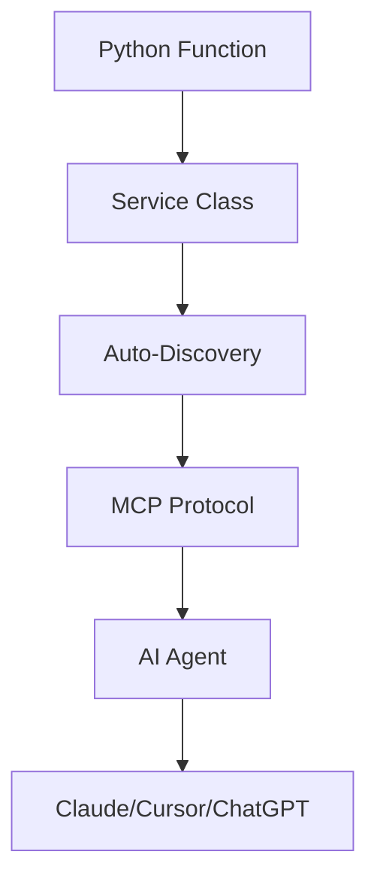

## 什么是 Tools？

Tools 是一些 Python functions，让 AI agents 能够与健康数据交互、执行动作并访问外部服务。Mirobody Health 的 tools 系统让你无需复杂配置就能非常轻松地扩展自定义能力。

<Info>
Tools 会从项目根目录的 `tools/` 自动发现，并通过 MCP protocol 对外暴露。
</Info>

## Tool 架构



<CardGroup cols={3}>
  <Card title="易于添加" icon="plus">
    编写 Python functions——无需 JSON schema
  </Card>
  <Card title="自动发现" icon="magnifying-glass">
    自动检测并注册 tools
  </Card>
  <Card title="MCP 原生" icon="bolt">
    通过 Model Context Protocol 立即可用
  </Card>
</CardGroup>

## 内置 Tools

Mirobody Health 默认包含两个关键的健康 tools：

### 1. get_user_health_profile

获取完整的用户健康 profile 信息。

```python
async def get_user_health_profile(user_info: UserInfo) -> Dict:
    """
    Get user health profile including connected devices and summary data
    
    Args:
        user_info: User authentication information (automatically provided)
        
    Returns:
        Dict containing user profile, connected providers, and health summary
    """
    pass
```

**Returns:**
- 用户 profile 信息
- 已连接的健康设备/providers
- 健康数据摘要与统计信息

### 2. get_health_indicator

获取用于分析的指定健康指标数据。

```python
async def get_health_indicator(
    user_info: UserInfo,
    indicator: str,
    start_time: Optional[str] = None,
    end_time: Optional[str] = None
) -> List[Dict]:
    """
    Get health indicator data for a specific metric
    
    Args:
        user_info: User authentication information (automatically provided)
        indicator: Health indicator name (e.g., "HEART_RATE", "STEPS")
        start_time: Optional start time filter (ISO format)
        end_time: Optional end time filter (ISO format)
        
    Returns:
        List of health indicator records
    """
    pass
```

**Use Cases:**
- 查询一段时间内的心率数据
- 获取睡眠模式
- 分析活动趋势
- 对比生物标志物

<Tip>
这些内置 tools 会查询 `theta_ai.th_series_data` 表，该表包含所有标准化的健康指标。
</Tip>

## Tool 分类

<Tabs>
  <Tab title="用户数据 Tools">
    需要认证的 **私有数据 tools**：
    - 访问用户健康指标
    - 查询个人 profiles
    - 获取设备数据
    - 分析个人趋势
    
    **Requirements：**
    - 必须包含 `user_info: UserInfo` 参数
    - 自动强制 OAuth 认证
    - 数据仅限当前认证用户范围
  </Tab>

  <Tab title="公共数据 Tools">
    无需用户认证的 **public tools**：
    - 检索健康相关文献
    - 访问公开健康数据库
    - 执行计算
    - Web 搜索
    
    **Requirements：**
    - 不需要 `user_info` 参数
    - 不需要认证
    - 可访问公开数据源
  </Tab>
</Tabs>

## Tools 如何工作

<Steps>
  <Step title="Tool 发现">
    启动时，Mirobody Health 会扫描 `tools/` 目录，查找包含 Service class 的 Python 文件。
    
    ```python
    # tools/my_tool.py
    class MyToolService:
        # All public methods become tools
        pass
    ```
  </Step>

  <Step title="自动注册">
    Service class 中的每个 public method 都会被自动注册为一个 tool。
    
    ```python
    class WeatherService:
        async def get_weather(self, location: str) -> Dict:
            """Get weather for location"""
            # This becomes a tool automatically
            pass
    ```
  </Step>

  <Step title="通过 MCP 暴露">
    Tools 会通过 MCP protocol 在 `http://localhost:18080/mcp` 暴露出来，供 AI agents 发现并调用。
  </Step>

  <Step title="Agent 调用">
    AI agents（Claude、Cursor、ChatGPT）可以通过 MCP 接口发现并调用你的 tools。
  </Step>
</Steps>

## Tool 配置

Tools 在 `config.yaml` 中配置：

```yaml config.yaml
# Tool Directories
MCP_TOOL_DIRS:
  - mirobody/pub/tools    # Built-in tools
  - tools                 # Your custom tools

# Tool Access Control
ALLOWED_TOOLS_SYNERGY:
  - get_user_health_profile
  - get_health_indicator
  - your_custom_tool

DISALLOWED_TOOLS_SYNERGY:
  - dangerous_tool
```

<Warning>
将 `ALLOWED_TOOLS_SYNERGY` 留空表示默认允许全部 tools。用 `DISALLOWED_TOOLS_SYNERGY` 来屏蔽特定 tools。
</Warning>

## 健康数据的数据库 Schema

Tools 可以从以下表中查询标准化健康数据：

### theta_ai.th_series_data

用于时间序列健康指标的主表：

| Column | Type | Description |
|--------|------|-------------|
| `id` | integer | Primary key |
| `user_id` | varchar | 用户标识 |
| `indicator` | varchar | 指标 code/name |
| `value` | text | 原始指标值 |
| `value_standardized` | text | 标准化后的指标值 |
| `start_time` | timestamp | 指标开始时间 |
| `end_time` | timestamp | 指标结束时间 |
| `source` | varchar | 数据来源（system/device/manual） |
| `source_table` | varchar | 原始来源表 |
| `source_table_id` | varchar | 来源记录 ID |
| `indicator_id` | text | 唯一指标标识 |
| `deleted` | integer | 删除标记（0: active, 1: deleted） |
| `create_time` | timestamptz | 创建时间戳 |
| `update_time` | timestamptz | 更新时间戳 |
| `task_id` | varchar | Task ID |
| `full_dim_id` | bigint | Full dimension ID |
| `fhir_id` | bigint | FHIR resource ID |
| `fhir_mapping_info` | jsonb | FHIR mapping 信息 |
| `is_standardized` | boolean | 标准化标记 |
| `comment` | text | 备注 |

### theta_ai.health_user_profile_by_system

用户 profile 存储表：

| Column | Type | Description |
|--------|------|-------------|
| `id` | integer | Primary key |
| `user_id` | varchar | 用户标识 |
| `version` | integer | 版本号 |
| `name` | varchar | Profile 名称 |
| `last_execute_doc_id` | integer | 上一次执行的 document ID |
| `common_part` | varchar | Profile 内容（JSON） |
| `create_time` | timestamp | 创建时间戳 |
| `last_update_time` | timestamp | 更新时间戳 |
| `is_deleted` | boolean | 删除标记 |

## 下一步

<CardGroup cols={2}>
  <Card title="Built-in Tools" icon="wrench" href="/zh/tools/built-in">
    浏览默认内置的健康 tools
  </Card>
  <Card title="Adding Custom Tools" icon="plus" href="/zh/tools/adding-tools">
    学习如何创建你自己的 tools
  </Card>
  <Card title="MCP Integration" icon="bolt" href="/zh/tools/mcp-integration">
    将 tools 连接到 Claude、Cursor 与 ChatGPT
  </Card>
  <Card title="Adding MCPs" icon="plug" href="/zh/tools/adding-mcps">
    了解如何添加并配置第三方 MCP servers
  </Card>
</CardGroup>
